# Cloud Security Specialist CSS (AZ-500).  

## Role Based Access Control.

**Lab scenario**

You have been asked to create a proof of concept showing how Azure users and groups are created. Also, how role-based access control is used to assign roles to groups. Specifically, you need to:
- Create a Senior Admins group containing the user account of Joseph Price as its member.  
- Create a Junior Admins group containing the user account of Isabel Garcia as its member.  
- Create a Service Desk group containing the user account of Dylan Williams as its member.  
- Assign the Virtual Machine Contributor role to the Service Desk group.  

### Lab objectives
In this lab, you will complete the following exercises:
- Exercise 1: Create the Senior Admins group with the user account Joseph Price as its member (the Azure portal).
- Exercise 2: Create the Junior Admins group with the user account Isabel Garcia as its member (PowerShell).
- Exercise 3: Create the Service Desk group with the user Dylan Williams as its member (Azure CLI).
- Exercise 4: Assign the Virtual Machine Contributor role to the Service Desk group.  

Role-Based Access Control architecture diagram

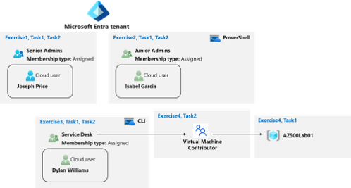

In this exercise, you will complete the following tasks:
- Task 1: Use the Azure portal to create a user account for Joseph Price.
- Task 2: Use the Azure portal to create a Senior Admins group and add the user account of Joseph Price to the group.

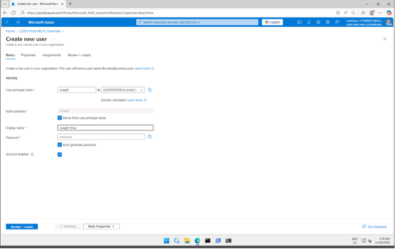

### Task2: Use the Azure portal to create a Senior Admins group and add the user account of Joseph Price to the group.

In the Azure portal, navigate back to the blade displaying your Microsoft Entra ID tenant.
1.	In the Manage section, click Groups, and then select + New group.
2.	On the New Group blade, specify the following settings (leave others with their default values):
Click the No owners selected link, on the Add owners blade, select Joseph Price, Joseph-57940691@LODSPRODMCA.onmicrosoft.com and click Select.

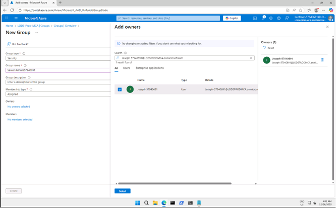

Click the No members selected link, on the Add members blade, select Joseph Price, Joseph-57940691@LODSPRODMCA.onmicrosoft.com and click Select.
1.	

### Exercise 2: Create a Junior Admins group containing the user account of Isabel Garcia as its member.  

1. Task 1: Use PowerShell to create a user account for Isabel Garcia.
2. Task 2: Use PowerShell to create the Junior Admins group and add the user account of Isabel Garcia to the group.

### Task 1: Use PowerShell to create a user account for Isabel Garcia.  

In this task, you will create a user account for Isabel Garcia by using PowerShell.
1.	Open the Cloud Shell by clicking the Cloud Shell icon in the top-right corner of the Azure portal.
2.	If prompted, select No storage account required, select the name of your subscription, and then select Apply. This is required only the first time you launch the Cloud Shell.
3.	In the Cloud Shell pane, ensure PowerShell is selected from the drop-down menu in the upper-left corner. (Note: In the new Cloud Shell, this will say: Switch to Bash). 

In the PowerShell session within the Cloud Shell pane, run the following to create a password profile object:

In the PowerShell session within the Cloud Shell pane, run the following to create a password profile object:

```
$passwordProfile = New-Object -TypeName Microsoft.Open.AzureAD.Model.PasswordProfile
```

1.	In the PowerShell session within the Cloud Shell pane, run the following to set the value of the password within the profile object:

```
$passwordProfile.Password = "Pa55w.rd1234"
```

2.	In the PowerShell session within the Cloud Shell pane, run the following to connect to Microsoft Entra ID:

```
Connect-AzureAD
```

3.	In the PowerShell session within the Cloud Shell pane, run the following to identify the name of your Microsoft Entra tenant: 

```
$domainName = ((Get-AzureAdTenantDetail).VerifiedDomains)[0].Name
```

4.	In the PowerShell session within the Cloud Shell pane, run the following to create a user account for Isabel Garcia:
Step 7 is for reference only, and can be skipped as this user has already been created for you. If you wish, you may run the command but you will receive the error New-AzureADUser: Error occurred while executing NewUser. This is expected in this Cloudslice lab and you may proceed to the next Step.

```
New-AzureADUser -DisplayName 'Isabel Garcia' -PasswordProfile $passwordProfile -UserPrincipalName "Isabel@$domainName" -AccountEnabled $true -MailNickName 'Isabel'
```

5.	In the PowerShell session within the Cloud Shell pane, run the following to list Microsoft Entra ID users (the accounts of Joseph and Isabel should appear on the listed):

```
Get-AzureADUser -All $true | Where-Object {$_.UserPrincipalName -like "Isabel-57940691*"}
```
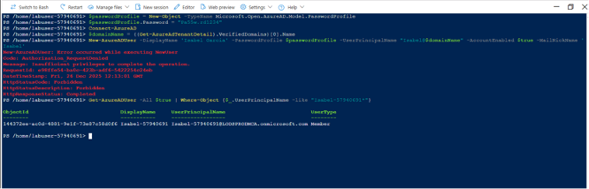

### Task2: Use PowerShell to create the Junior Admins group and add the user account of Isabel Garcia to the group.
In this task, you will create the Junior Admins group and add the user account of Isabel Garcia to the group by using PowerShell.
1. In the same PowerShell session within the Cloud Shell pane, run the following to create a new security group named Junior Admins:
powershellTypeCopy
New-AzureADGroup -DisplayName 'Junior Admins5794069157940691' -MailEnabled $false -SecurityEnabled $true -MailNickName JuniorAdmins

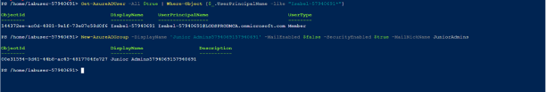

2.	In the PowerShell session within the Cloud Shell pane, run the following to list groups in your Microsoft Entra tenant (the list should include the Senior Admins57940691 and Junior Admins57940691 groups)

```
Get-AzureADGroup
```
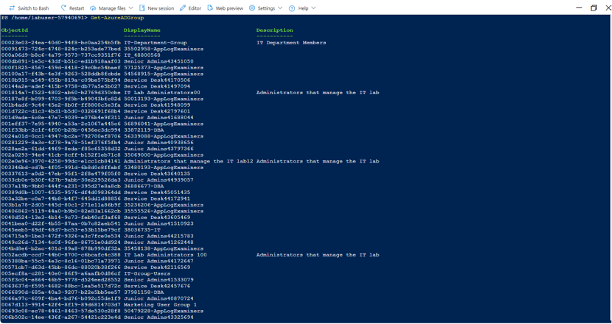

3. In the PowerShell session within the Cloud Shell pane, run the following to obtain a reference to the user account of Isabel Garcia:

```
$user = Get-AzureADUser -Filter "UserPrincipalName eq 'Isabel-57940691@LODSPRODMCA.onmicrosoft.com'"
```

4. In the PowerShell session within the Cloud Shell pane, run the following to add the user account of Isabel to the Junior Admins5794069157940691 group:

```
Add-AzADGroupMember -MemberUserPrincipalName $user.userPrincipalName -TargetGroupDisplayName "Junior Admins5794069157940691"
```

5. In the PowerShell session within the Cloud Shell pane, run the following to verify that the Junior Admins5794069157940691 group contains the user account of Isabel:

```
Get-AzADGroupMember -GroupDisplayName "Junior Admins5794069157940691"
```
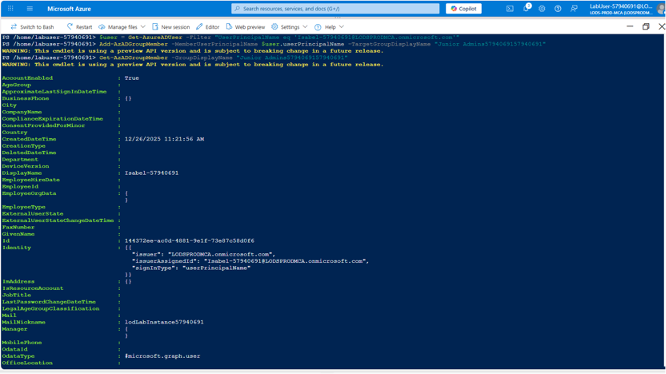

### Exercise 3: Create a Service Desk group containing the user account of Dylan Williams as its member.

In this exercise, you will complete the following tasks:  
- Task 1: Use Azure CLI to create a user account for Dylan Williams.
- Task 2: Use Azure CLI to create the Service Desk group and add the user account of Dylan to the group.

#### Task 1: Use Azure CLI to create a user account for Dylan Williams.

In this task, you will create a user account for Dylan Williams.
1. In the drop-down menu in the upper-left corner of the Cloud Shell pane, select Bash (or: Switch to Bash), and, when prompted, click Confirm.  
2.	In the Bash session within the Cloud Shell pane, run the following to identify the name of your Microsoft Entra tenant:

```
DOMAINNAME=$(az ad signed-in-user show --query 'userPrincipalName' | cut -d '@' -f 2 | sed 's/\"//')
```

3. In the Bash session within the Cloud Shell pane, run the following to create a user, Dylan Williams. Use yourdomain.  
Step 3 is for reference only, as this user has already been created for you. If you wish, you may run the command but you will receive the error Insufficient privileges to complete the operation. This is expected in this Cloudslice lab and you may proceed to the next Step.

```
az ad user create --display-name "Dylan Williams" --password "Pa55w.rd1234" --user-principal-name Dylan@$DOMAINNAME
```

4. In the Bash session within the Cloud Shell pane, run the following to list Microsoft Entra ID user accounts (the list should include user accounts of Joseph, Isabel, and Dylan)

```
az ad user list --output table | grep 57940691
```
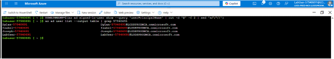

### Task 2: Use Azure CLI to create the Service Desk group and add the user account of Dylan to the group.

In this task, you will create the Service Desk group and assign Dylan to the group.
1. In the same Bash session within the Cloud Shell pane, run the following to create a new security group named Service Desk.

```
az ad group create --display-name "Service Desk57940691" --mail-nickname "ServiceDesk"
```
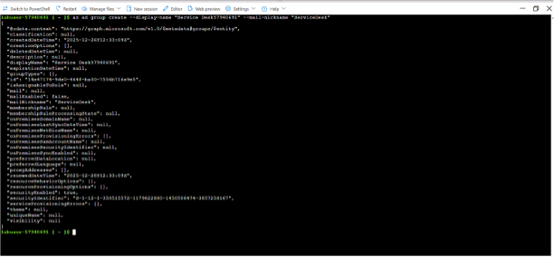

2. In the Bash session within the Cloud Shell pane, run the following to list the Microsoft Entra ID groups (the list should include Service Desk57940691, Senior Admins57940691, and Junior Admins57940691 groups):

```
az ad group list -o table
```

3.	In the Bash session within the Cloud Shell pane, run the following to obtain a reference to the user account of Dylan Williams:

```
USER=$(az ad user list --filter "UserPrincipalName eq 'Dylan-57940691@LODSPRODMCA.onmicrosoft.com'")
```

4.	In the Bash session within the Cloud Shell pane, run the following to obtain the objectId property of the user account of Dylan Williams:

```
OBJECTID=$(echo $USER | jq '.[].id' | tr -d '"')
```

5.	In the Bash session within the Cloud Shell pane, run the following to add the user account of Dylan to the Service Desk57940691 group:

```
az ad group member add --group "Service Desk57940691" --member-id $OBJECTID
```

6.	In the Bash session within the Cloud Shell pane, run the following to list members of the Service Desk57940691 group and verify that it includes the user account of Dylan:

```
az ad group member list --group "Service Desk57940691"
```

7.	Close the Cloud Shell pane.
Result: Using Azure CLI you created a user and a group accounts, and added the user account to the group.

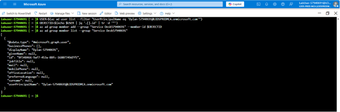

### Exercise 4: Assign the Virtual Machine Contributor role to the Service Desk group.

In this exercise, you will complete the following tasks:
- Task 1: Create a resource group.
- Task 2: Assign the Service Desk Virtual Machine Contributor permissions to the resource group.

**Task 1: Create a resource group**
1. In the Azure portal, in the Search resources, services, and docs text box at the top of the Azure portal page, type Resource groups and press the Enter key.
2. On the Resource groups blade, click + Create and specify the following settings:

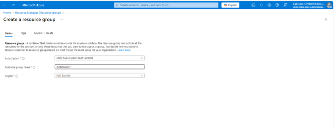

Back on the Resource groups blade, refresh the page and verify your new resource group appears in the list of resource groups

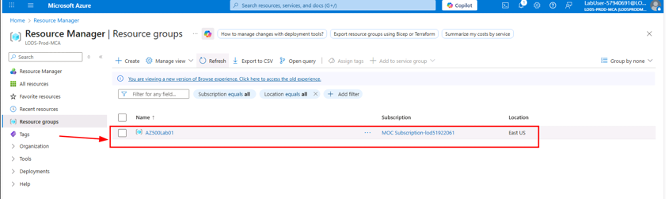

### Task 2: Assign the Service Desk Virtual Machine Contributor permissions.
1. On the Resource groups blade, click the AZ500LAB01 resource group entry.
2. On the AZ500Lab01 blade, click Access control (IAM) in the middle pane.
3. On the AZ500Lab01 | Access control (IAM) blade, click + Add and then, in the drop-down menu, click Add role assignment.

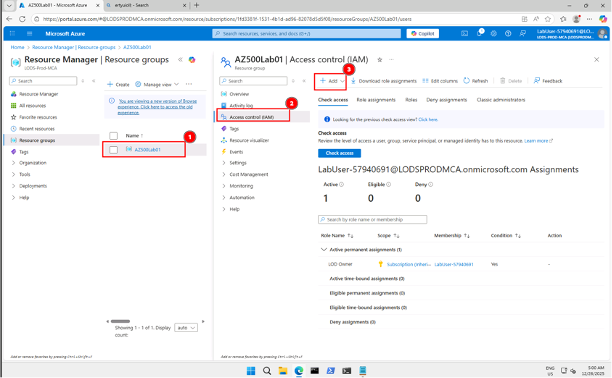

4.	On the Add role assignment blade, complete each of the following settings before clicking Next:

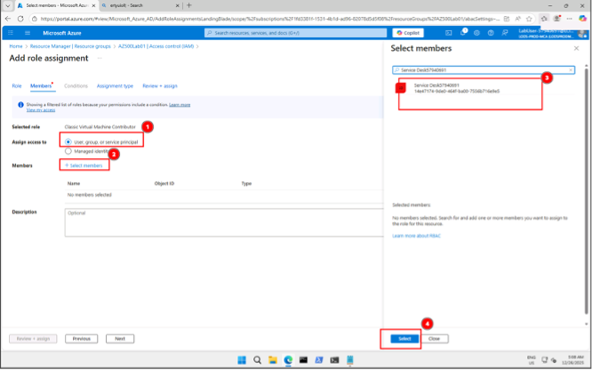

Click Review + assign twice to create the role assignment.
1. From the Access control (IAM) blade, select Check access.
2. On the AZ500Lab01 | Access control (IAM) blade, on the Check access tab, in the Search by name or email address text box, check access for Dylan-57940691@LODSPRODMCA.onmicrosoft.com.

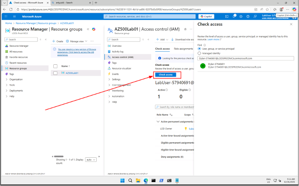

3. In the list of search results, select the user account of Dylan Williams and, on the Dylan Williams assignments - AZ500Lab01 blade, view the newly created assignment.

**NOTE - Always remember to check both the Active and Eligible tabs when confirming RBAC assignments.**

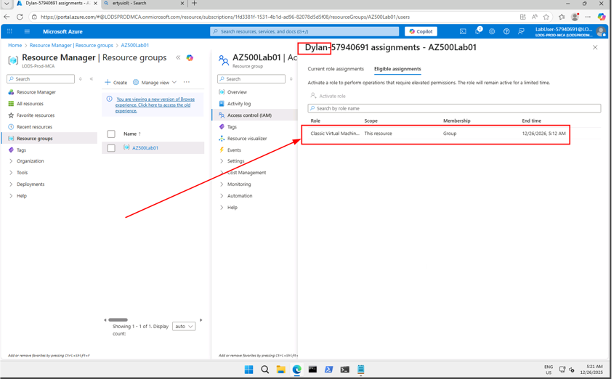

4. Close the Dylan Williams assignments - AZ500Lab01 blade.
5. Repeat the same last two steps to check access for Joseph-57940691@LODSPRODMCA.onmicrosoft.com.

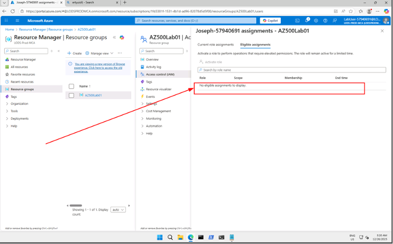


**January 12, 2025**. 
