# Network Security Groups and Application Security Groups

**Lab scenario**

You have been asked to implement your organization's virtual networking infrastructure and test to ensure it is working correctly. In particular:
- The organization has two groups of servers: Web Servers and Management Servers.
- Each group of servers should be in its own Application Security Group.
- You should be able to RDP into the Management Servers, but not the Web Servers.
- The Web Servers should display the IIS web page when accessed from the internet.
- Network security group rules should be used to control network access.

**Lab objectives**

In this lab, you will complete the following exercises:
- Exercise 1: Create the virtual networking infrastructure
- Exercise 2: Deploy virtual machines and test the network filters

Network and Application Security Groups diagram

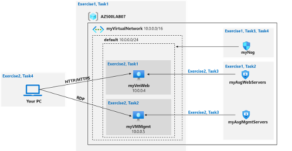

### Instructions
## Exercise 1: Create the virtual networking infrastructure
Estimated timing: 20 minutes
For all the resources in this lab, we are using the East (US) region. Verify with your instructor this is the region to use for your class.
In this exercise, you will complete the following tasks:
- Task 1: Create a virtual network with one subnet.  
- Task 2: Create two application security groups.  
- Task 3: Create a network security group and associate it with the virtual network subnet.  
- Task 4: Create inbound NSG security rules to all traffic to web servers and RDP to the management servers.  

#### Task 1: Create a virtual network
On the Basics tab of the Create virtual network blade, specify the following settings (leave others with their default values) and click Next: IP Addresses:

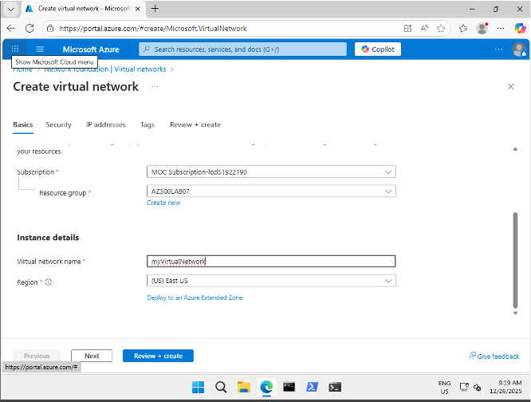

On the IP addresses tab of the Create virtual network blade, set the IPv4 address space to 10.0.0.0/16, and, if needed, in the Subnet name column, click default, on the Edit subnet blade, specify the following settings and click Save:

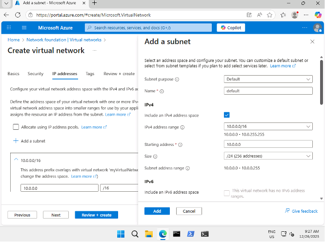

On the Review + create tab of the Create virtual network screen, click Create.


Create application security groups
In this task, you will create an application security group.
1.	In the Azure portal, in the Search resources, services, and docs text box at the top of the Azure portal page, type Application security groups and press the Enter key.
2.	On the Application security groups blade, click + Create.
3.	On the Basics tab of the Create an application security group blade, specify the following settings:

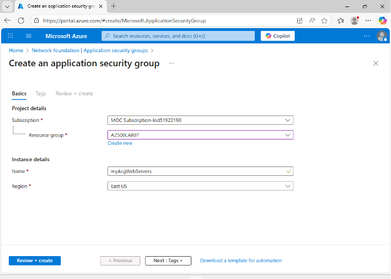

Click Review + create and then click Create.
1.	Navigate back to the Application security groups blade and click + Create.
2.	On the Basics tab of the Create an application security group blade, specify the following settings:

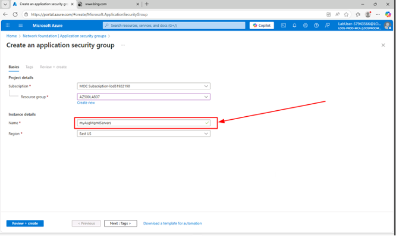


Click Review + create and then click Create.

Create a network security group and associate the NSG to the subnet
In this task, you will create a network security group.
1.	In the Azure portal, in the Search resources, services, and docs text box at the top of the Azure portal page, type Network security groups and press the Enter key.
2.	On the Network security groups blade, click + Create.
3.	On the Basics tab of the Create network security group blade, specify the following settings:

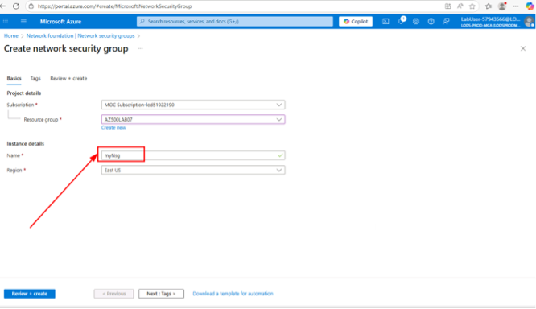

Click Review + create and then click Create.
1.	In the Azure portal, navigate back to the Network security groups blade and select the myNsg entry. Or select Go to resource if available.
2.	On the myNsg blade, in the Settings section, click Subnets and then select + Associate.
3.	On the Associate subnet blade, specify the following settings and select OK:

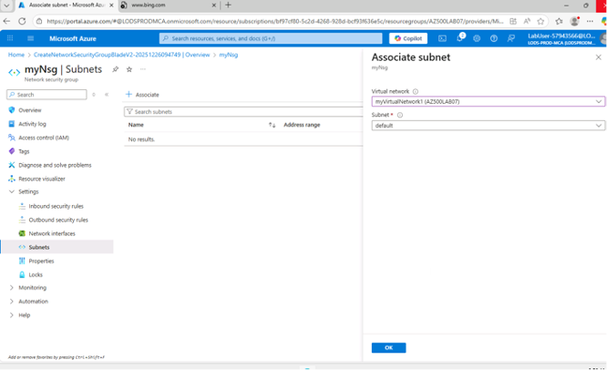

## Create inbound NSG security rules to all traffic to web servers and RDP to the servers. 

1.	On the myNsg blade, in the Settings section, click Inbound security rules.
2.	Review the default inbound security rules and then click + Add.
3.	On the Add inbound security rule blade, specify the following settings to allow TCP ports 80 and 443 to the myAsgWebServers application security group (leave all other values with their default values):

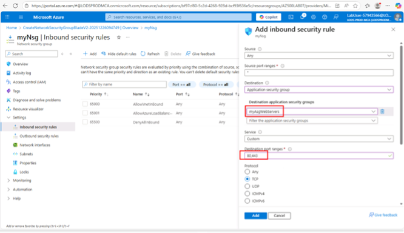

Select the Add button on the Add inbound security rule page, to create the new inbound rule.
1.	On the myNsg blade, in the Settings section, click Inbound security rules, and then click + Add.
2.	On the Add inbound security rule blade, specify the following settings to allow the RDP port (TCP 3389) to the myAsgMgmtServers application security group (leave all other values with their default values):

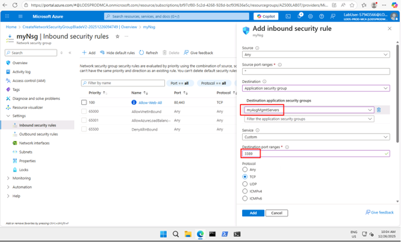

**Select Add on the Add inbound security rule page, to create the new inbound rule**

## Exercise 2: Deploy virtual machines and test network filters

In this exercise, you will complete the following tasks:
- Task 1: Create a virtual machine to use as a web server.
- Task 2: Create a virtual machine to use as a management server.
- Task 3: Associate each virtual machines network interface to it's application security group.
- Task 4: Test the network traffic filtering.

### Task 1: Create a virtual machine to use as a web server. 
In this task, you will create a virtual machine to use as a web server.
1.	In the Azure portal, in the Search resources, services, and docs text box at the top of the Azure portal page, type Virtual machines and press the Enter key.
2.	On the Virtual machines blade, click + Create and, in the dropdown list, click Virtual machine.
3.	On the Basics tab of the Create a virtual machine blade, specify the following settings (leave others with their default

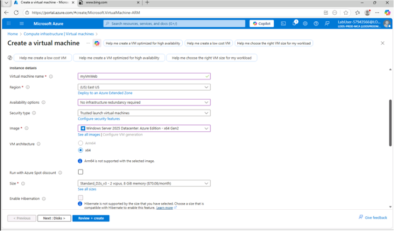

Click Next: Disks > and, on the Disks tab of the Create a virtual machine blade, set the OS disk type to Standard HDD and click Next: Networking >. 

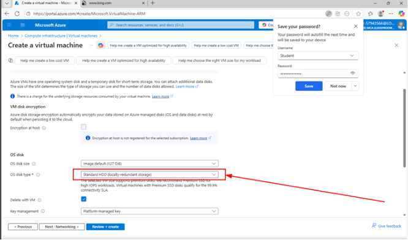

On the Networking tab of the Create a virtual machine blade, select the previously created network myVirtualNetwork and the default (10.0.0.0/24) subnet.

Under NIC network security group select None.

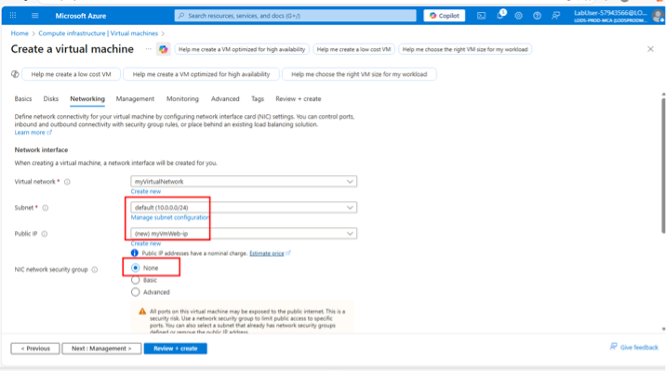

Click Next: Management >, then click Next: Monitoring >. On the Monitoring tab of the Create a virtual machine blade, verify the following setting:  

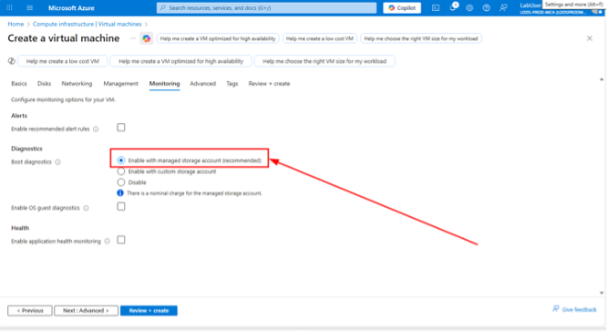

Click Review + create, on the Review + create blade, ensure that validation was successful and click Create.

## Create a virtual machine to use as a management server.

In this task, you will create a virtual machine to use as a management server.
1.	In the Azure portal, navigate back to the Virtual machines blade, click + Create, and, in the dropdown list, click Virtual machine.
2.	On the Basics tab of the Create a virtual machine blade, specify the following settings (leave others with their default values):

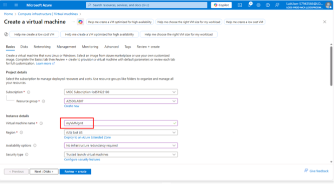

Click Next: Disks > and, on the Disks tab of the Create a virtual machine blade, set the OS disk type to Standard HDD and click Next: Networking >

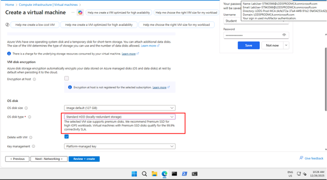

On the Networking tab of the Create a virtual machine blade, select the previously created network myVirtualNetwork and the default (10.0.0.0/24) subnet.

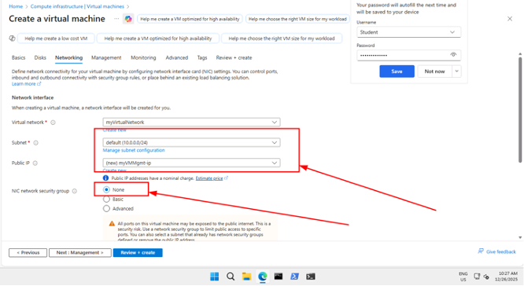

**Under NIC network security group select None.**

1.	Click Next: Management >, then click Next: Monitoring >. On the Monitoring tab of the Create a virtual machine blade, verify the following setting:

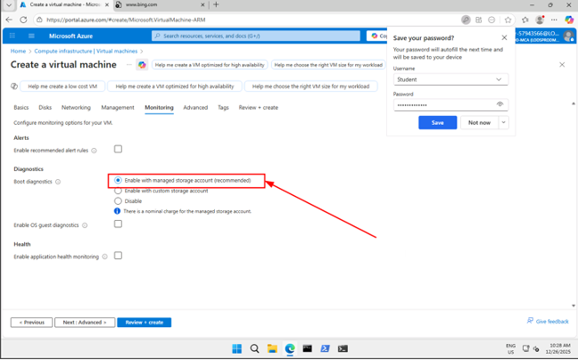

**Click Review + create, on the Review + create blade, ensure that validation was successful and click Create.**

## Task 3: Associate each virtual machine's network interface to its application security group.  

In this task, you will associate each virtual machines network interface with the corresponding application security group. The myVMWeb virtual machine interface will be associated to the myAsgWebServers ASG. The myVMMgmt virtual machine interface will be associated to the myAsgMgmtServers ASG.
1.	In the Azure portal, navigate back to the Virtual machines blade and verify that both virtual machines are listed with the Running status.
2.	In the list of virtual machines, click the myVMWeb entry.
3.	On the myVMWeb blade, in the Networking section, click Network settings and then, on the myVMWeb | Networking settings blade, click the Application security groups tab.
4.	Click + Add application security groups, in the Application security group list, select myAsgWebServers, and then click Save.

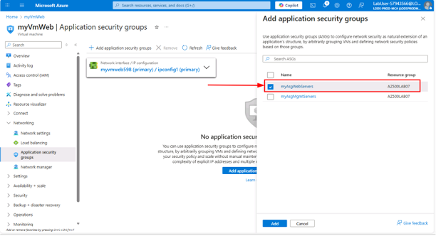

5.	Navigate back to the Virtual machines blade and in the list of virtual machines, click the myVMMgmt entry.
6.	On the myVMMgmt blade, in the Networking section, click Networking settings and then, on the myVMMgmt | Networking settings blade, click the Application security groups tab.
7.	Click + Add application security groups, in the Application security group list, select myAsgMgmtServers, and then click Add.

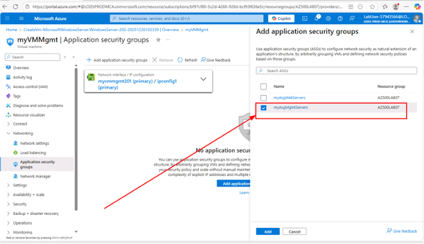

**Test the network traffic filtering**

In this task, you will test the network traffic filters. You should be able to RDP into the myVMMgmnt virtual machine. You should be able to connect from the internet to the myVMWeb virtual machine and view the default IIS web page.
1.	Navigate back to the myVMMgmt virtual machine blade.  
2.	On the myVMMgmt Overview blade, click Connect and, in the drop down menu, click Connect.  


3.	Download the RDP file and use it to connect to the myVMMgmt Azure VM via Remote Desktop. When prompted to authenticate, provide the following credentials:  

In the Azure portal, navigate to the myVMWeb virtual machine blade.  
1.	On the myVMWeb blade, in the Operations section, click Run command and then click RunPowerShellScript.
2.	On the Run Command Script pane, run the following to install the Web server role on myVmWeb:

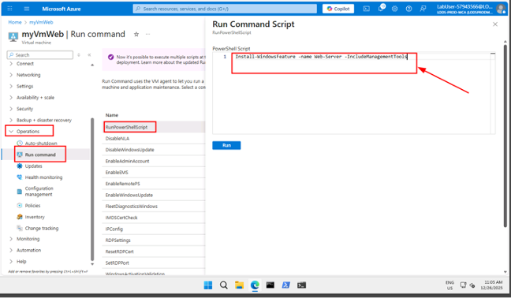

Wait for the installation to complete. This might take a couple of minutes. At that point, you can verify that myVMWeb can be accessed via HTTP/HTTPS.  

In the Azure portal, navigate back to the myVMWeb blade.  
1.	On the myVMWeb blade, identify the Public IP address of the myVmWeb Azure VM.  
2.	Open another browser tab and navigate to IP address you identified in the previous step.  
The browser page should display the default IIS welcome page because port 80 is allowed inbound from the internet based on the setting of the myAsgWebServers application security group. The network interface of the myVMWeb Azure VM is associated with that application security group.  
```
Result: You have validated that the NSG and ASG configuration is working and traffic is being correctly managed.
```


