# Challenge Labs supporting AZ-500: Secure Azure using Microsoft Defender for Cloud and Microsoft Sentinel

## Configure Security Recommendations for an Azure Virtual Machine

# Enable Microsoft Defender for SQL in an Azure SQL Database

**Understand the scenario**

You are an Administrator for Hexelo, an organization that needs to migrate its primary web app from its on-premises datacenter to Azure®.
In this Challenge Lab, you will create a new Azure SQL database and enable Microsoft Defender for SQL. First, you will create an Azure SQL database. Next, you will enable Microsoft Defender for SQL. Finally, you will verify the security features of Microsoft Defender for SQL.  

Create an Azure SQL database on a new logical SQL server by using the values in the following table. For any property that is not specified, use the default value.  

On the Azure portal global command bar, search for and select SQL Databases.
- On the SQL databases blade, select Create SQL database.

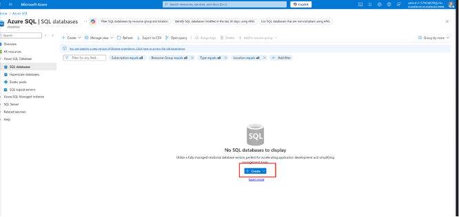

- On the Create SQL Database blade, on the Basics page, in Project details, in Resource group, select corp-datalod57924878.
- In Database details, in Database name, enter db57924878.  
- In Server, select Create new.  
- On the Create SQL Database Server blade, in Server details, in Server name, enter sql57924878.  

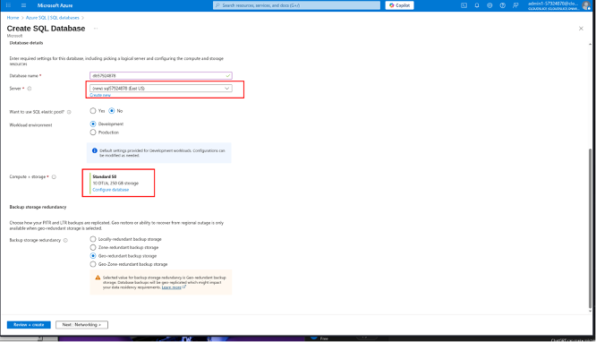

- In Authentication, in Authentication method, select Use SQL authentication.
- In Server admin login, enter AzureAdmin, in Password and Confirm password, enter AzPwd57924878!, and then select OK.

- On the Create SQL Database blade, on the Basics page, in Database details, in Workload environment, select Development.
- In Compute + storage, select Configure database.
- On the Configure blade, in Service and compute tier, in Service Tier, select Standard (Budget friendly).
- Ensure that the DTUs slider is set to 10, ensure that the Data max size (GB) slider is set to 250, and then select Apply.

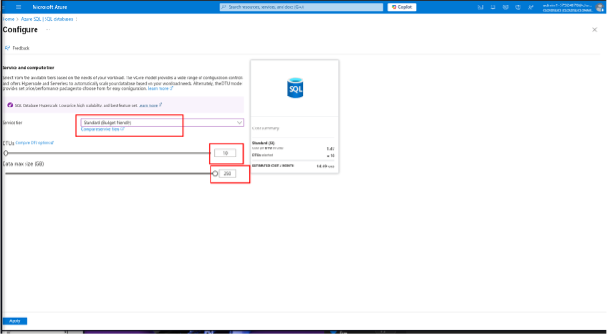

- On the Create SQL Database blade, select Next: Networking.
- On the Networking page, in Network connectivity, in Connectivity method, select Public endpoint.
- In Firewall rules, in Allow Azure services and resources to access this server, select Yes.
- In Add current client IP address, select Yes, and then select Next: Security.

- On the Security page, in Microsoft Defender for SQL, in Enable Microsoft Defender for SQL, ensure that Not now is selected, and then select Next: Additional settings.

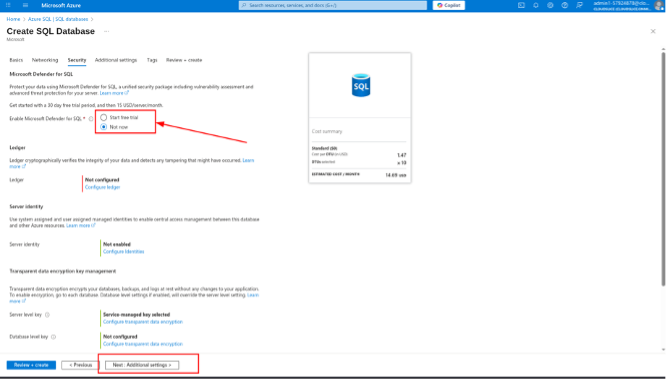

- On the Additional settings page, in Data source, in Use existing data, select Sample, and then in the AdventureWorksLT prompt, select OK to continue.  

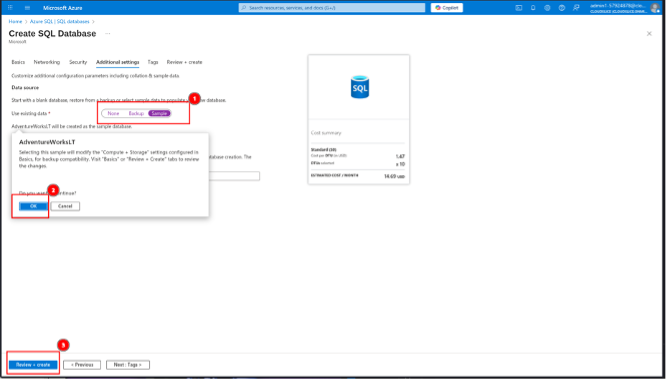

- Select Review + create, review the configuration, and then select Create.
Azure SQL Database is a fully managed database that supports automatic patching, upgrades, and backups.

**Want to learn more? Review the documentation on Azure SQL Database.**

Log in to the db57924878 database as AzureAdmin using AzPwd57924878! as the password, and then create a query to retrieve all of the rows in the SalesLT.Customer table. 

n the Deployment page, select Go to resource.
- On the db57924878 service menu, select Query editor (preview).
- On the Query editor (preview) page, in Login, ensure that AzureAdmin is entered, in Password, enter AzPwd57924878!, and then select OK.

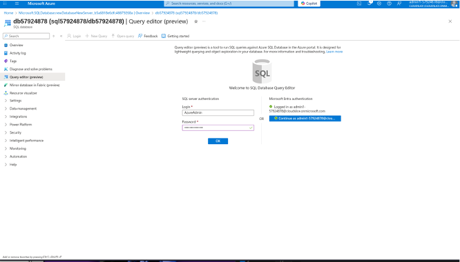

- In Line 1 of the Query1 script, enter the following SQL code:

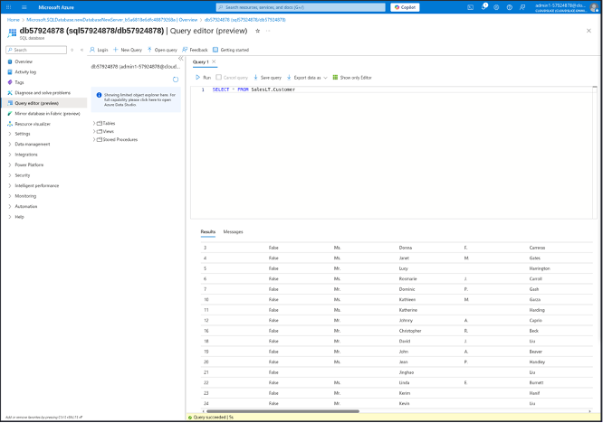

Select Run to execute the Query1 script, and then review the results

Enable Microsoft Defender for SQL

Enable Microsoft Defender for SQL for the db57924878 database

On the db57924878 service menu, in Security, select Microsoft Defender for Cloud.
- On the Microsoft Defender for Cloud page, in Microsoft Defender for SQL, select Enable.

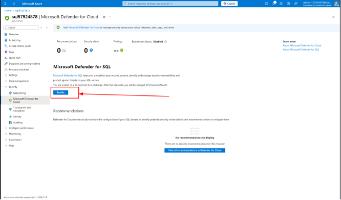

### Perform a vulnerability assessment for the db57924878 database

On the db57924878 Microsoft Defender for Cloud page, scroll down, and then in Vulnerability assessment findings, select View additional findings in Vulnerability Assessment.

Manage security recommendations in Microsoft Defender for SQL. 

In the Vulnerability assessment, review the 'dbo' user should not be used for normal service operation finding, and then approve the current scan result as the Baseline value.  

On the Microsoft Defender for SQL Vulnerability assessment page, in Findings, in ID, select VA1143 to open the finding.  

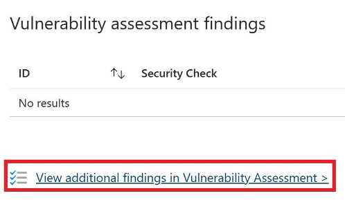

On the Vulnerability Assessment page, on the command bar, select Scan

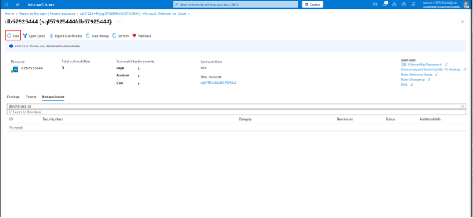

The vulnerability assessment scan may take a few minutes to fully register in Azure. You can select Refresh on the command bar to display the latest status. You can also rerun the vulnerability assessment if you see no results.  
	
Review the recommendations provided in the vulnerability assessment for the database. 

SQL Vulnerability Assessment is a feature of Microsoft Defender for SQL that you can use to identify and remediate potential database vulnerabilities.
Want to learn more? Review the documentation on SQL Vulnerability Assessment.

Manage security recommendations in Microsoft Defender for SQL
YesNo

In the Vulnerability assessment, review the 'dbo' user should not be used for normal service operation finding, and then approve the current scan result as the Baseline value.

On the Microsoft Defender for SQL Vulnerability assessment page, in Findings, in ID, select VA1143 to open the finding.

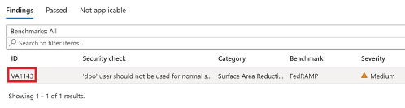

On the Finding pane, review the Finding details for the 'dbo' user should not be used for normal service operation rule, and then note the message: There is no remediation script for this rule.

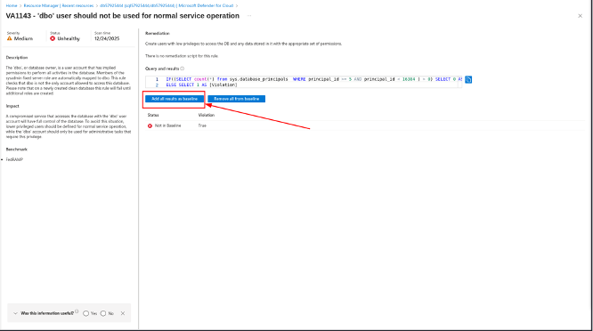

On the Set baseline popup, review the message, and then select Yes.

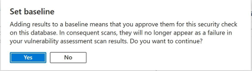

Verify that the Status for the finding is now In Baseline.

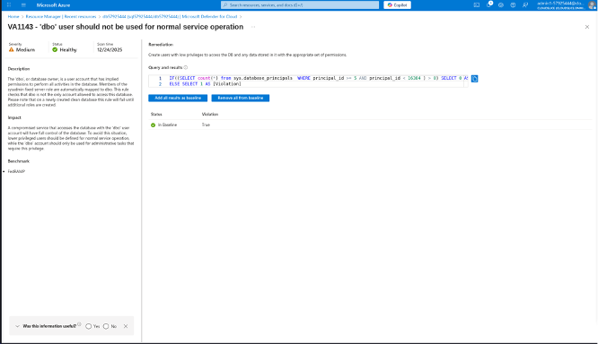

Close the Finding pane.

You can select the Add all results as Baseline option to indicate that you accept the current settings. The finding will not appear in the list of vulnerabilities after the next scan unless you change the current settings.  

Perform another scan, and then review the vulnerability assessment recommendations again.  
Note that the 'dbo' user should not be used for normal service operation finding has been removed from the Findings tab. If there are no findings (Total vulnerabilities 0), then the Passed list is displayed to show all the rules that were passed.  

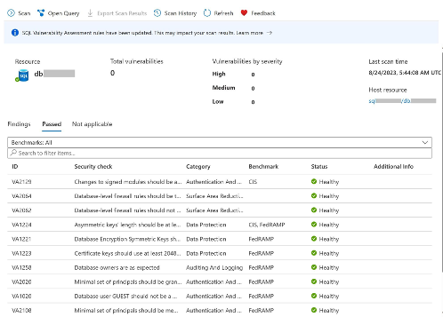

Review the Data Discovery & Classification recommendations for the db57925444 database, and then accept all of the recommendations.
On the Azure portal menu, select All resources, and then select the db57925444 SQL database.
- On the db57925444 service menu, in Security, select Data Discovery & Classification.
- On the Data Discovery & Classification page, select the message at the top of the page: Currently database is using SQL information Protection policy. Found 15 columns with classification recommendations to view the recommendations.

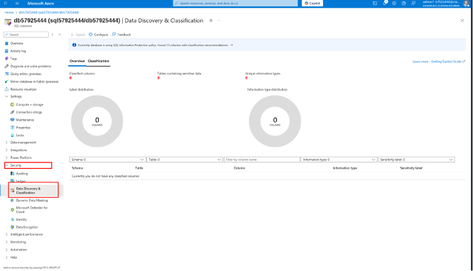

On the Classification page, select the Select all check box, and then select Accept selected recommendations.

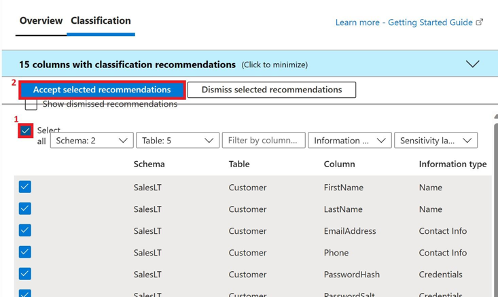

On the Data Discovery & Classification page, on the command bar, select Save.  

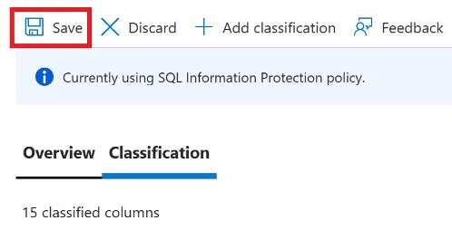

You can use Data Discovery & Classification to discover and classify sensitive data columns in a database, as well as create custom labels and reports.

Want to learn more? Review the documentation on Data Discovery & Classification.

## Summary
Congratulations, you have completed the Enable Microsoft Defender for SQL in an Azure SQL Database Challenge Lab.
You have accomplished the following:
- Created an Azure SQL database.
- Enabled Microsoft Defender for SQL.
- Managed security recommendations in Microsoft Defender for SQL.

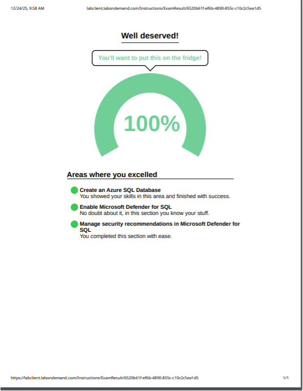

**January 1, 2026**

