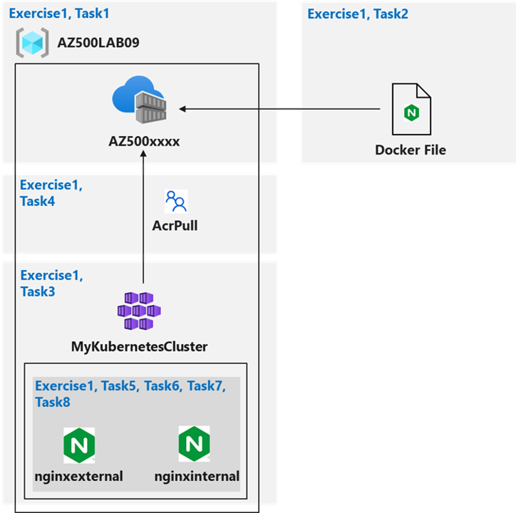
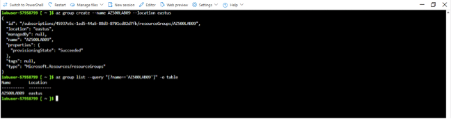
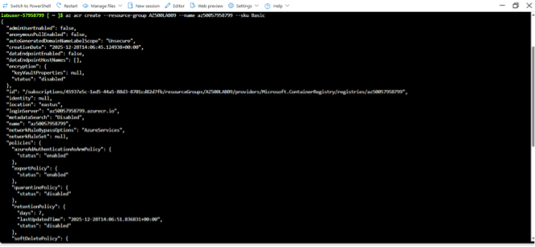
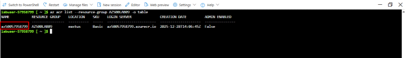
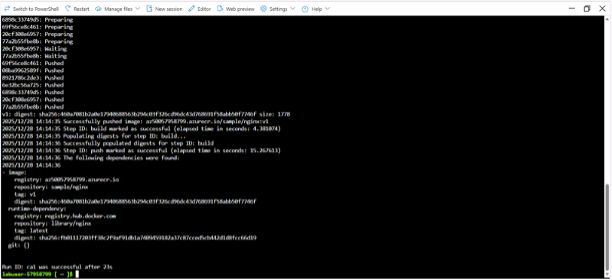
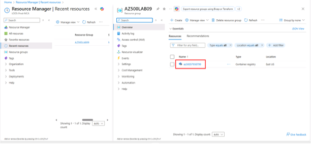
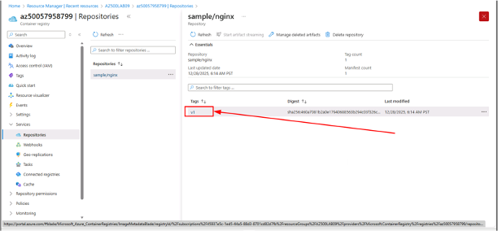
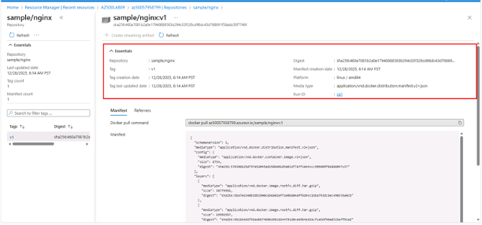

# Configuring and Securing ACR and AKS 

**Lab scenario**

You have been asked to deploy a proof of concept with Azure Container Registry and Azure Kubernetes Service. Specifically, the proof of concept should demonstrate:
- Using Dockerfile to build an image.
- Using Azure Container Registry to store images.
- Configuring an Azure Kubernetes Service.
- Securing and accessing container applications both internally and externally.

For all the resources in this lab, we are using the East US region. Verify with your instructor this is the region to use for class.
Lab objectives. 
In this lab, you will complete the following exercise:
### Exercise 1: Configuring and Securing ACR and AKS
Configuring and Securing ACR and AKS diagram. 



Instructions
Lab files:
- **\Allfiles\Labs\09\nginxexternal.yaml**
- **\Allfiles\Labs\09\nginxinternal.yaml**

## Exercise 1: Configuring and Securing ACR and AKS
In this exercise, you will complete the following tasks:
- Task 1: Create an Azure Container Registry
- Task 2: Create a Dockerfile, build a container and push it to Azure Container Registry
- Task 3: Create an Azure Kubernetes Service cluster
- Task 4: Grant the AKS cluster permissions to access the ACR
- Task 5: Deploy an external service to AKS
- Task 6: Verify the you can access an external AKS-hosted service
- Task 7: Deploy an internal service to AKS
- Task 8: Verify the you can access an internal AKS-hosted service

### Task 1: Create an Azure Container Registry
In this task, you will create a resource group for the lab and an Azure Container Registry.  

In the Azure portal, open the Cloud Shell by clicking the first icon in the top right of the Azure Portal. If prompted, click Bash, No storage account required, select your Subscription, and then click Apply.
1.	Ensure Bash is selected in the drop-down menu in the upper-left corner of the Cloud Shell pane.
2.	In the Bash session within the Cloud Shell pane, run the following to create a new resource group for this lab:
```
az group create --name AZ500LAB09 --location eastus
```
3.	In the Bash session within the Cloud Shell pane, run the following to verify the resource group was created:

```
az group list --query "[?name=='AZ500LAB09']" -o table
```


4.	In the Bash session run the following commands to register the Container Registery in the lab environment.
```
   az provider register --namespace Microsoft.Kubernetes
   az provider register --namespace Microsoft.KubernetesConfiguration
   az provider register --namespace Microsoft.OperationsManagement
   az provider register --namespace Microsoft.OperationalInsights
   az provider register --namespace Microsoft.ContainerService
   az provider register --namespace Microsoft.ContainerRegistry
```


1. In the Bash session within the Cloud Shell pane, run the following to create a new Azure Container Registry (ACR) instance (The name of the ACR must be globally unique):
```
az acr create --resource-group AZ500LAB09 --name az50057958799 --sku Basic
```
2. In the Bash session within the Cloud Shell pane, run the following to confirm that the new ACR was created:
```
az acr list --resource-group AZ500LAB09 -o table
```

**Record the name of the ACR. You will need it in the next task.**




## Task 2: Create a Dockerfile, build a container and push it to Azure Container Registry

In this task, you will create a Dockerfile, build an image from the Dockerfile, and deploy the image to the ACR.
1. In the Bash session within the Cloud Shell pane, run the following to create a Dockerfile to create an Nginx-based image:
```
echo FROM nginx > Dockerfile
```
2. In the Bash session within the Cloud Shell pane, run the following to build an image from the Dockerfile and push the image to the new ACR.

The trailing period at the end of the command line is required. It designates the current directory as the location of Dockerfile.
```
ACRNAME=$(az acr list --resource-group AZ500LAB09 --query '[].{Name:name}' --output tsv)
az acr build --resource-group AZ500LAB09 --image sample/nginx:v1 --registry $ACRNAME --file Dockerfile
```

**Wait for the command to successfully complete. This might take about 2 minutes.**



3. Close the Cloud Shell pane.
4. In the Azure portal, navigate to the AZ500LAB09 resource group and, in the list of resources, click the entry representing the Azure Container Registry instance you provisioned in the previous task.  



5.	On the Container registry blade, in the Services section, click Repositories.

6.	Verify that the list of repositories includes the new container image named sample/nginx.
7.	Click the sample/nginx entry and verify presence of the v1 tag that identifies the image version.



8.	Click the v1 entry to view the image manifest.



**The manifest includes the sha256 digest, manifest creation date, and platform entries.**

## Task 3: Create an Azure Kubernetes Service cluster


