# Challenge Labs supporting AZ-500: Secure compute, storage, and databases

## Configure Security for an Azure Cosmos DB Account 

# Create an Azure Cosmos DB account

**Understand the scenario**
You are an Administrator for Hexelo, an organization that needs to configure security for a new Azure Cosmos DB® account.
In this Challenge Lab, you will configure security for an Azure Cosmos DB Account. First, you will deploy an Azure Cosmos DB account, and then you will create a container in a new database. Next, you will add items to the container, and then you will configure security for the account. Finally, you will test secure access to the Azure Cosmos DB account.
Create an Azure Cosmos DB account by using the values in the following table. For any property that is not specified, use the default value.  

On the Azure portal home page, select Create a resource to open the Azure Marketplace.
- In the Azure Marketplace, search for and select Azure Cosmos DB, and then select the Azure Cosmo DB tile.  
- On the Azure Cosmo DB blade, select Create. 

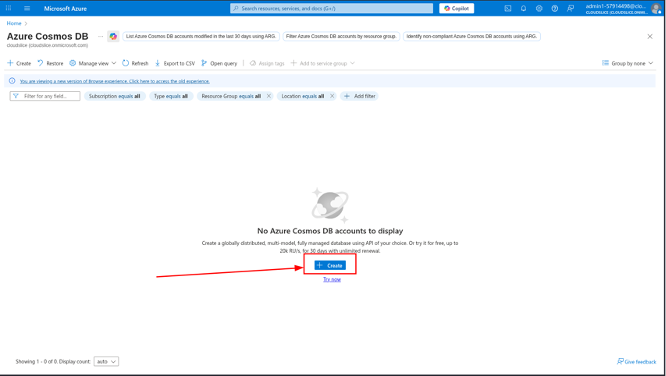

On the Create an Azure Cosmos DB account blade, in the Azure Cosmos DB for NoSQL tile, select Create.

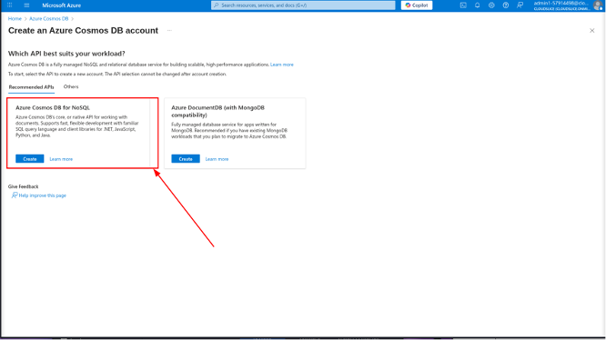

In the Create Azure Cosmos DB Account blade, on the Basics page, in Project Details, in Resource Group, select corp-datalod57914498.
- In Instance Details, in Account Name, enter cosmos57914498.
- In Location, select (US) East US.
- In Apply Free Tier Discount, select Do Not Apply, and then select Next: Global distribution.  

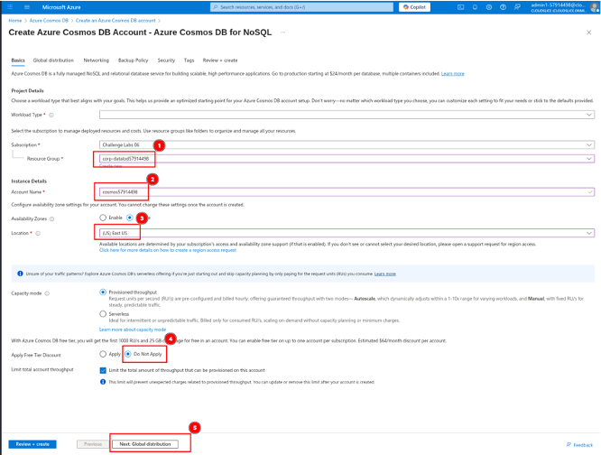

- On the Global Distribution page, in Geo-Redundancy, select Disable, and then in Multi-region Writes, select Disable.
- Select Review + create, review the configuration, and then select Create.

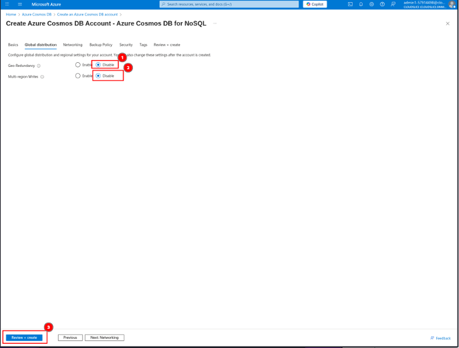

Create a container named Customers in a new database named Database1 in the cosmos57914498 account that uses a partition key of /_partitionKey and a Container Max RU/s of 1000.

### On the Deployment blade, select Go to resource.
- On the cosmos57914498 service menu, select Data Explorer.
If a Welcome! What is Cosmos DB? window is displayed, close the window.
- On the Data Explorer page, select New Container.

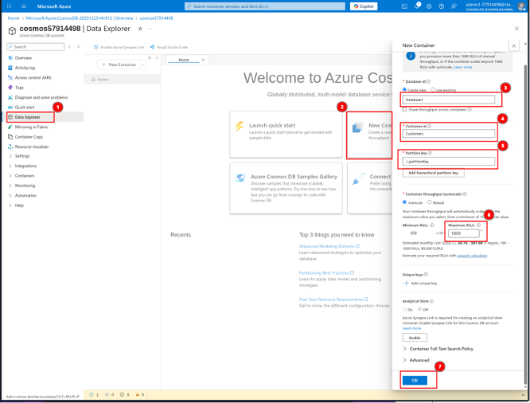

On the New Container blade, in Database id, enter Database1, and then in Container id, enter Customers.
- In Partition key, enter /_partitionKey, in Container Max RU/s, enter 1000, and then select OK to add the container.

You create a container in a database. The Azure portal allows you to create the database at the same time as the first container. The partition key is used to automatically distribute data across multiple servers for scalability.

**Want to learn more? Review the documentation on partitioning.**

Create a new item in the Customers container by using the following JSON code:  

On the Data Explorer page, expand Database1, expand Customers, and then select Items.  

On the command bar, select New Item. 

On the Items page, overwrite the existing JSON code with the following JSON code:  

Create a second item in the Customers container by using the following JSON code:

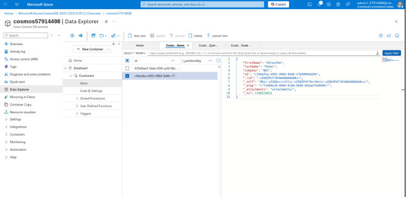

Create a new SQL query that selects all the items in the Customers container, and then execute the query.
On the Data Explorer page, ensure that Items is selected, and then on the command bar, select New SQL Query.

On the command bar, select Execute Query.

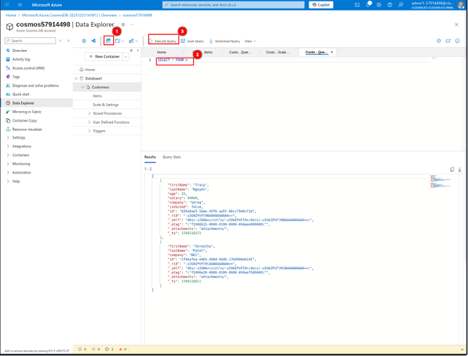

## Configure secure access

Create a virtual network in the Azure portal by using the values in the following table. For any property that is not specified, use the default value.

On the Azure portal menu, in Azure services, select Create a resource to display the Azure Marketplace.
- In Search services and marketplace, search for and select Virtual Network, and then select Create.

On the Create virtual network blade, on the Basics page, in Resource group, ensure that corp-datalod57914498 is selected.
- In Virtual network name, enter AppVNet, and then select the IP addresses tab.

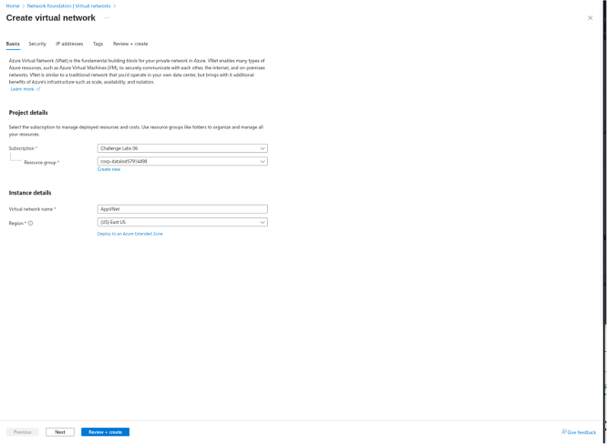

On the IP addresses page, select the Edit icon (pencil) for the default subnet. 

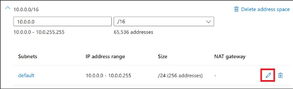

On the Edit subnet pane, in Name, enter App, and then in IPv4, in Starting address, enter 10.0.10.0.
- In Size, ensure that /24 (256 addresses) is selected, and then select Save.
- Select Review + create, and then select Create to create the virtual network.

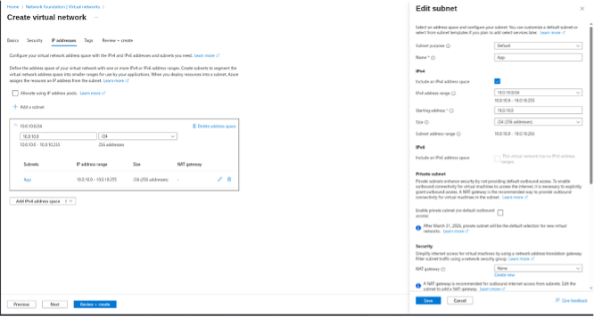

Want to learn more? Review the documentation on creating a virtual network.

Allow access to the cosmos57915361 Azure Cosmos DB account from the App subnet in the AppVNet virtual network and from your current IP address.

On the Azure portal home page, in Navigate, select All resources, and then on the All resources blade, select cosmos57915361.
- On the cosmos57915361 service menu, in Settings, select Networking.
- On the Networking Public access page, in Public network access, select Selected networks, and then in Virtual networks, select Add existing virtual network.

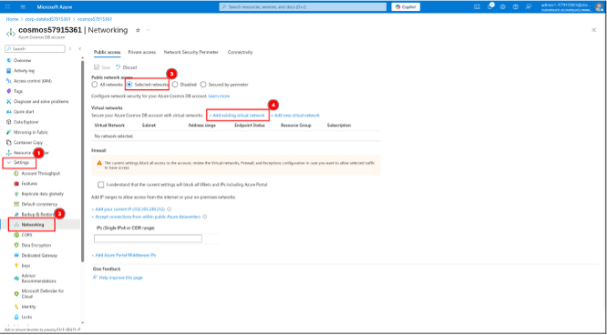

On the Add networks blade, in Virtual networks, select the AppVNet checkbox.
- In Subnets, select the App (Service endpoint required) checkbox, and then select Enable.  

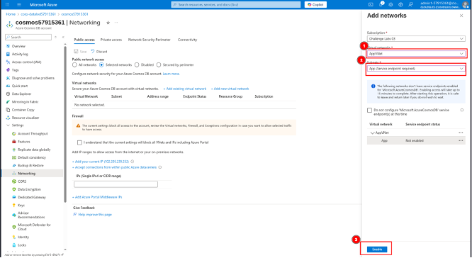

- On the Add networks blade, select Add.
- On the Networking Public access page, in Firewall, select Add my current IP.

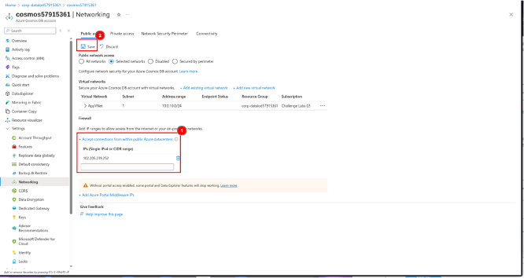

On the Networking Public access page, select Save.

A service endpoint will be created in the background and may take up to 15 minutes to fully deploy. You may continue to the next task.

**Want to learn more? Review the documentation on creating a service endpoint.**

Assign the Cosmos DB Account Reader Role to User1-57915361 for the cosmos57915361 Azure Cosmos DB account.

On the cosmos57915361 service menu, select Access control (IAM).
- On the Access control (IAM) page, in Grant access to this resource, select Add role assignment.

Attempt to create a new item in the Customers container by using the following JSON code:  

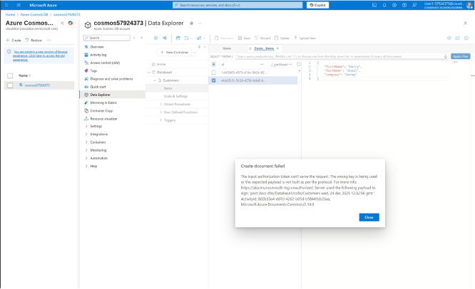

The operation should fail with an The input authorization token can't serve the request error message because the user has read-only access.

Close the InPrivate or incognito browser window.

### Summary
Congratulations, you have completed the Configure Security for an Azure Cosmos DB Account Challenge Lab.
You have accomplished the following:
- Created an Azure Cosmos DB account.
- Created a container and added items to the container.
- Configured security for the Azure Cosmos DB account.
- Tested access to the Azure Cosmos DB accoun

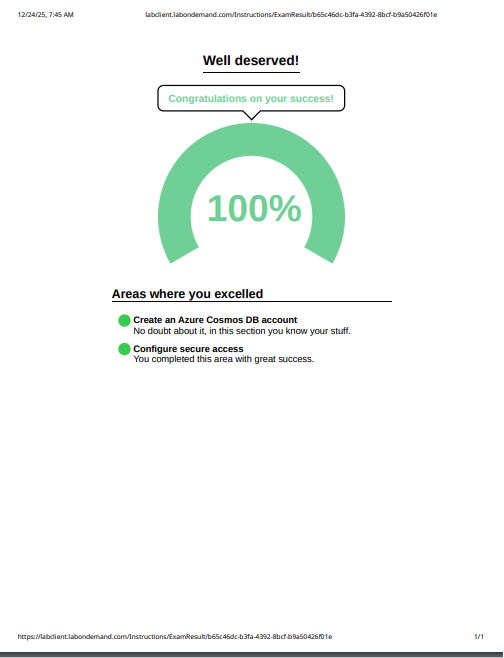

**December 4, 2025**