# Challenge Labs supporting AZ-500: Secure compute, storage, and databases. 

## Configure Azure Disk Encryption. 

**Understand the scenario**  

You are a Security Engineer for Hexelo, an organization that needs to configure Azure® disk encryption.  
In this Challenge Lab, you will enable Azure Disk Encryption on an Azure virtual machine. First, you will create a virtual machine. Next, you will add a data disk to the virtual machine. Finally, you will enable Azure Disk Encryption.  
Create an Azure virtual machine by using the values in the following table. For any property that is not specified, use the default value.

### On the Azure portal home page, in Azure services, select Virtual machines.  
- On the Virtual machines blade, on the command bar, select +Create, and then select Virtual machine.

- On the Create a virtual machine blade, on the Basics page, in Project details, in Resource group, select corp-datalod57910351.
- In Instance details, in Virtual machine name, enter webVM1.

- In Availability options, select No infrastructure redundancy required.  
- In Image, select Windows Server 2025 Datacenter - x64 Gen2.   
- In Size, select See all sizes.  
- On the Select a VM size blade, search for and select B2as_v2, and then select Select.  
- In Administrator account, in Username, enter AzureAdmin, and then in Password and Confirm password, enter Az!57910351!.  

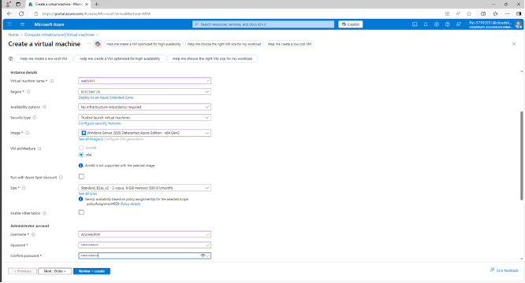

- In Inbound port rules, in Public inbound ports, ensure that Allow selected ports is selected, in Select inbound ports, ensure that RDP (3389) is selected, and then select Next:Disks>.  

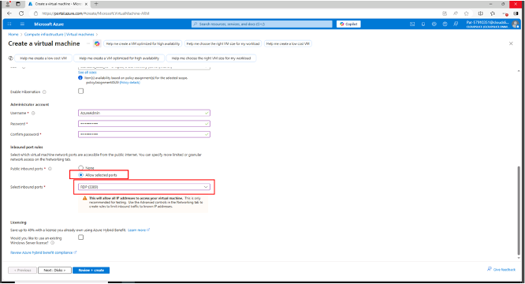

- On the Disks page, in OS disk, in OS disk type, select Standard HDD. 

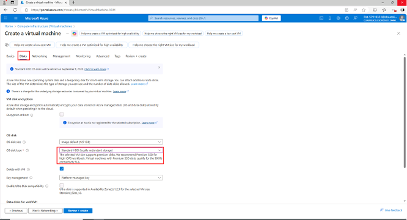

- On on the Monitoring page, in Diagnostics, in Boot diagnostics, select Disable.
- Select Review + create, review the virtual machine specifications, and then select Create to deploy the virtual machine.

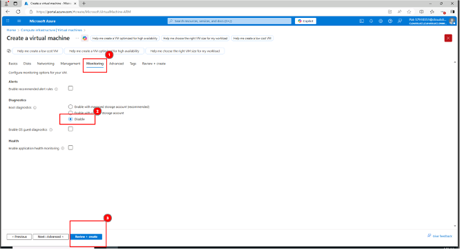

Verify that webVM1 contains one OS disk that uses SSE with PMK encryption, and that there are no data disks.
On the Deployment blade, select Go to resource.  
- On the webVM1 service menu, in Settings, select Disks.  
- On the Disks page, in OS disk, verify that there is one disk, and then in the Encryption column, verify that the value is set to SSE with PMK.  
- In Data disk, verify that there are no data disks.  

Server-side encryption (SSE) of Azure Disk Storage is enabled by default and encrypts disks at the storage server level by using a platform-managed key (PMK). The encryption key is managed automatically by the platform, in this case Azure, including protection and regular rotation. You can use server-side encryption with a customer-managed key (SSE with CMK) to manage the encryption key manually for compliance reasons. You can combine SSE with Azure Disk Encryption (ADE), which additionally encrypts the disk at the OS level by using technologies such as BitLocker (Windows) or DM-Crypt (Linux), for what is called double encryption at rest high security requirements.

**Want to learn more? Review the documentation on Server-side encryption.**

Add a new data disk to the Azure virtual machine
Create a new disk named DataFiles that is attached to webVM1, and then configure the disk by using the Standard HDD OS disk type and a size of 128 GiB.  

**On the webVM1 Disks page, in Data disks, select Create and attach a new disk.**

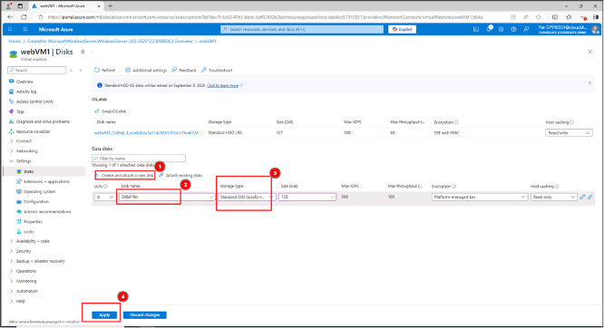 

**The update will take approximately 1-2 minutes. Wait for the update to complete before moving on to the next step.**

Connect to webVM1 by using RDP, and then when prompted, sign in as AzureAdmin using Az!57910351! as the password.
On the webVM1 Overview page, on the command bar, select Connect, and then select Connect.
- In the Native RDP tile, select Download RDP file.  

 

- Open the RDP file, and then in the Remote Desktop Connection window, select Connect.
- When prompted for credentials, in User Name, ensure that AzureAdmin is displayed, in Password, enter Az!57910351!, and then select OK.

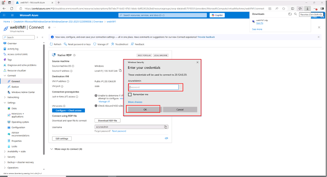

- In the Remote Desktop Connection message box, select Yes, and then wait for the RDP session to initialize.
- In the RDP session, if prompted to allow your PC to be discoverable by other PCs and devices on this network, select No.

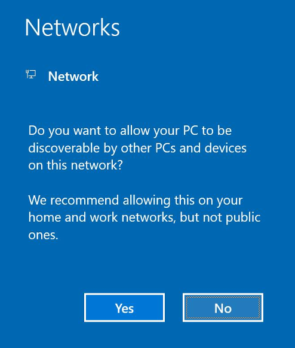

Wait for Server Manager to load, and then minimize Server Manager.
In the Remote Desktop Connection window, right-click Start, and then select Disk Management.
- In the Initialize Disk dialog, select MBR (Master Boot Record, and then select OK.)

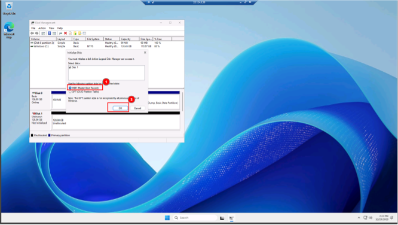

In Disk Management, right-click the new, unallocated disk, and then select New Simple Volume.

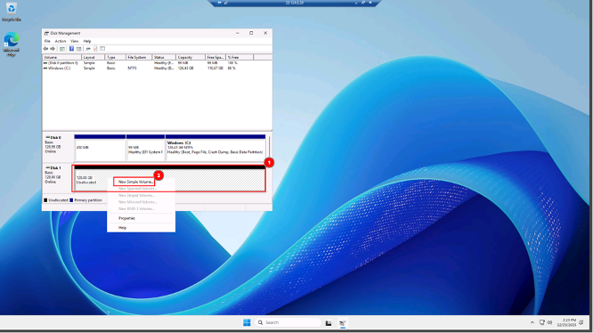

In the New Simple Volume Wizard, select Next twice to advance to the Assign Drive Letter or Path page.
- In Assign the following drive letter, ensure that F is selected, and then select Next.

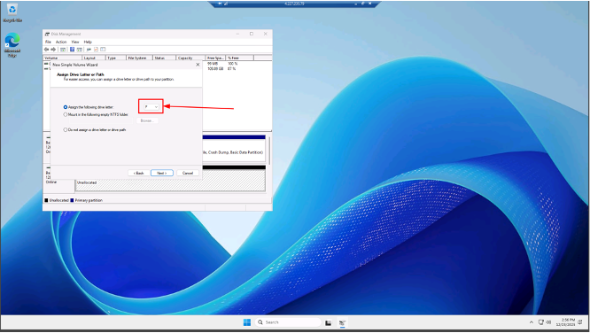

- In Format this volume with the following settings, in File system, ensure that NTFS is selected, and then in Volume label, enter DataFiles,
- Select Next, and then select Finish to format the new disk. 

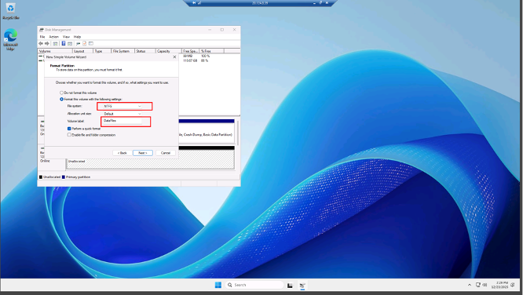

**Close the Disk Management window.**
If prompted by a Your remote session will be disconnected message, select OK. 

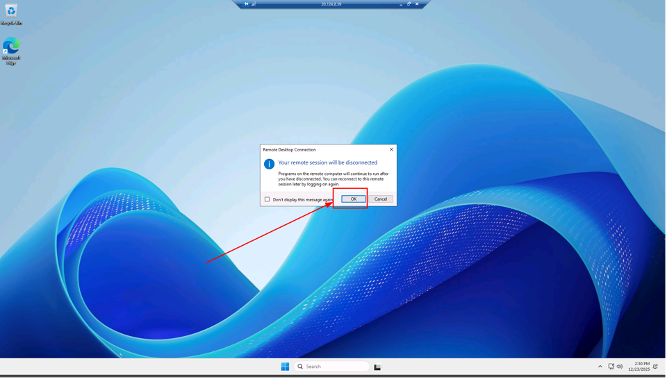

## Enable Azure Disk Encryption

Create an Azure key vault by using the values in the following table. For any property that is not specified, use the default value.  

On the Azure portal menu, select Create a resource to display the Azure marketplace.  
- In the Azure marketplace, search for and select Key Vault, and then select the Key Vault tile.
- On the Key vault blade, select Create.

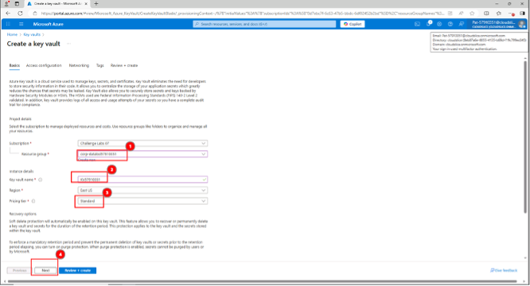

On the Create key vault blade, in Project details, in Resource group, select corp-datalod57910351.
- In Instance details, in Key vault name, enter KV57910351, in Pricing tier, ensure that Standard is selected, and then select Next.

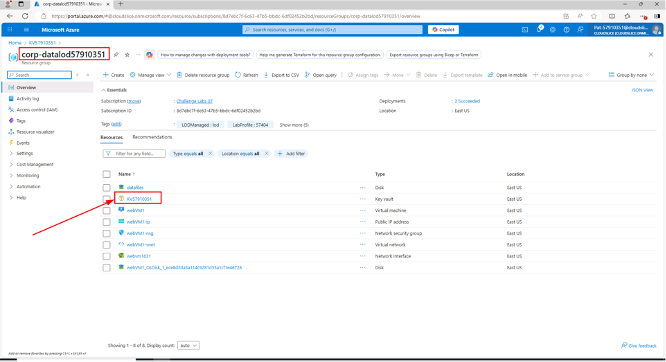

- On the Access configuration page, in Resource access, select the Azure Disk Encryption for volume encryption checkbox.
Retrieve the properties of the KV57911140 key vault in the corp-datalod57911140 resource group by using the Get-AzKeyVault cmdlet and store the results in a local variable named $KeyVault.
In Azure Cloud Shell, run the following command to retrieve the properties of the key vault:

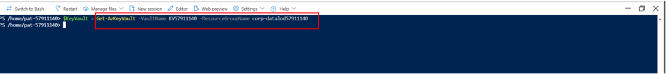

Want to learn more? Review the documentation on the Get-AzKeyVault cmdlet.  

Enable Azure Disk Encryption for webVM1 by using the Set-AzVMDiskEncryptionExtension cmdlet and the corp-datalod57911140 resource group.  

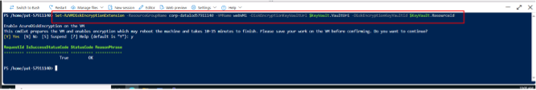

The command will take approximately 2-3 minutes to complete.

**Want to learn more? Review the documentation on Set-AzVMDiskEncryptionExtension cmdlet.**

On the Azure portal home page, in Azure services, select Virtual machines, and then select webVM1.
- On the webVM1 service menu, in Settings, select Disks.
- On the Disks page, verify that there is now an OS disk and a data disk that both use SSE with PMK & ADE encryption.

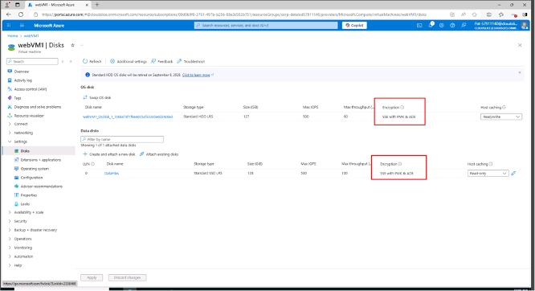

Summary
Congratulations, you have completed the Configure Azure Disk Encryption Challenge Lab.
You have accomplished the following:
- Created an Azure virtual machine.  
- Added a new data disk to the Azure virtual machine.  
- Enabled Azure Disk Encrypt. 

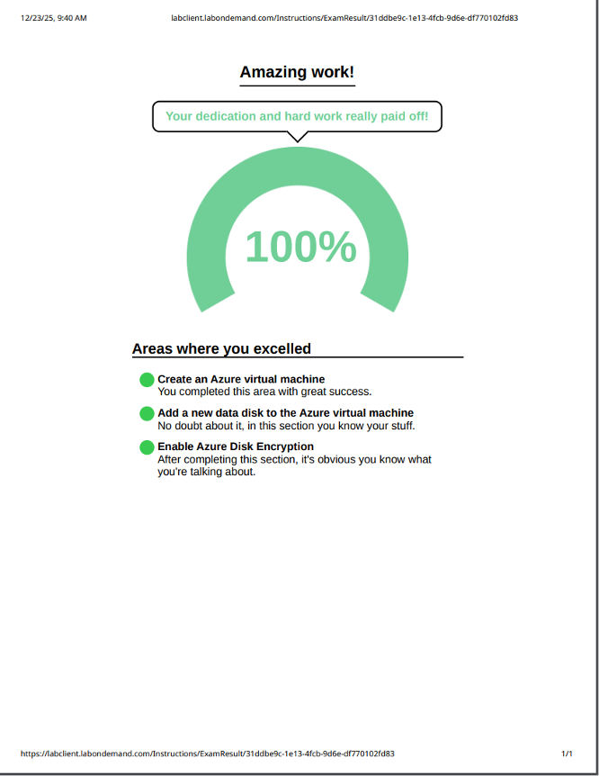

