# Challenge Labs supporting AZ-500: Secure networking

## Configure an Application Security Group

### Create a virtual network

Create a virtual network by using the Azure portal and the values in the following table. For any property that is not specified, use the default value.  

On the Azure portal home page, in Azure services, select Create a resource to display the Azure marketplace.
- In the marketplace, search for and select Virtual Network, and then select the Virtual network tile.
- On the Virtual network blade, select Create. 

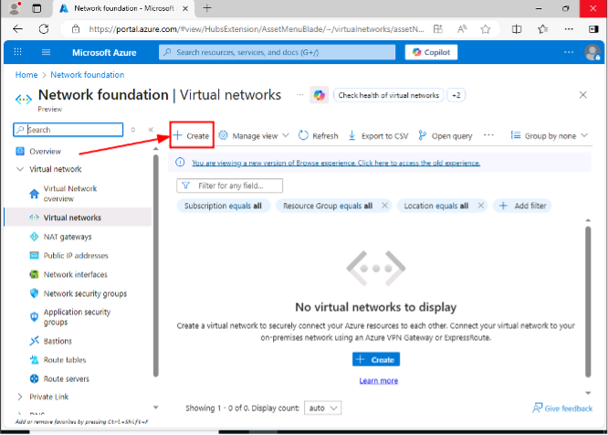

On the Create virtual network blade, on the Basics page, in Project details, in Resource group, select corp-datalod57908754.
- In Instance details, in Virtual network name, enter webVNET, and then select the IP Addresses tab.  

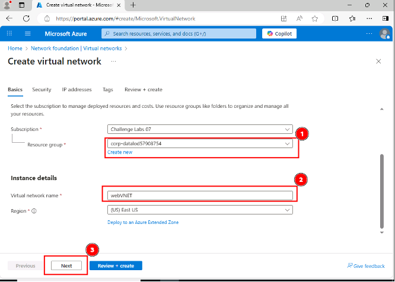

On the IP Addresses page, in IPv4 address space, select the existing address space 10.0.0.0/16, and then enter 10.10.0.0/16 to overwrite the value.  
- On the IP Addresses page, in Subnets, select the Trash icon to delete the existing default subnet.  

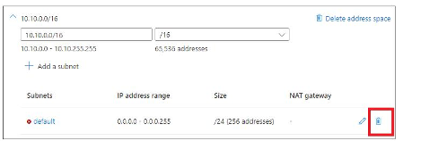

**Select Add a subnet.**

On the Create virtual network blade, select Review + create.
- Review the configuration, and then select Create to create the virtual network.

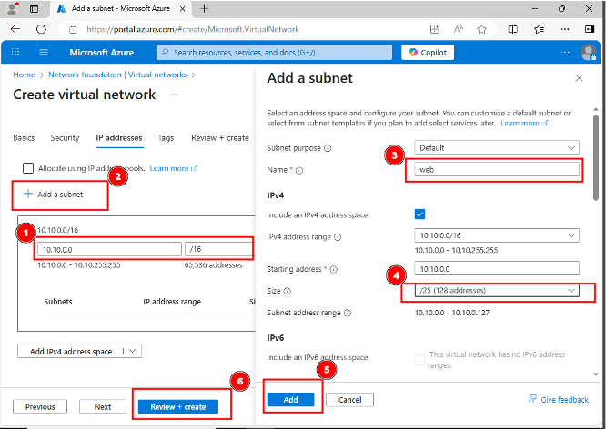

You can use an Azure virtual network to create a network address space in the cloud that you will use to host resources-for example, virtual machines, load balancers, and application gateways-for secure access from on-premises networks and other virtual networks.
Want to learn more? Review the documentation on:  
- Azure virtual networks.  
- Creating a virtual network.  
Create Azure security groups.  

Create an application security group named webASG in the corp-datalod57908754 resource group. 

On the Azure portal menu, select Create a resource to display the Azure marketplace. 
- In the Azure marketplace, search for and select Application security group, and then select the Application security group tile.
- On the Application security group blade, select Create.

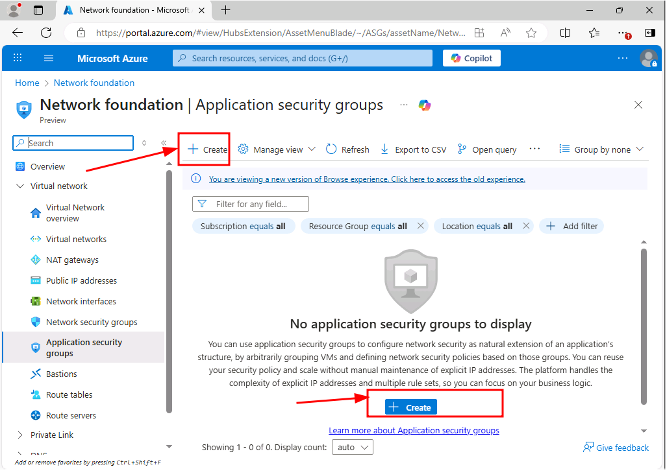

On the Create an application security group blade, in Project details, in Resource group, select corp-datalod57908754.
- In Instance details, in Name, enter webASG.
- Select Review + create, review the configuration, and then select Create.

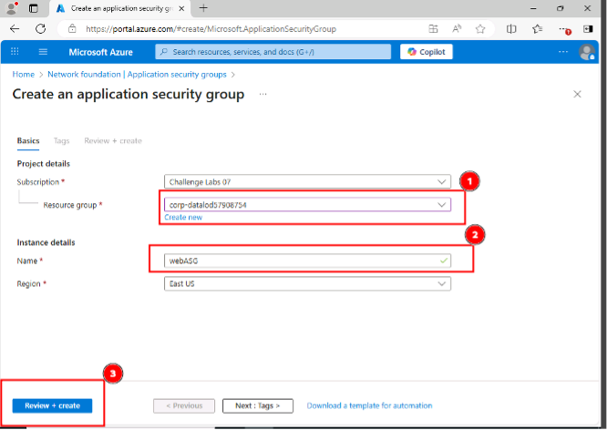

Want to learn more? Review the following documentation:
- Application Security Groups
- Creating an application security group

Create a network security group named webNSG in the corp-datalod57908754 resource group.
On the Azure portal menu, select Create a resource to display the Azure marketplace.
- In the Azure marketplace, search for and select Network security group, and then select the Network security group tile.
- On the Network security group blade, select Create.

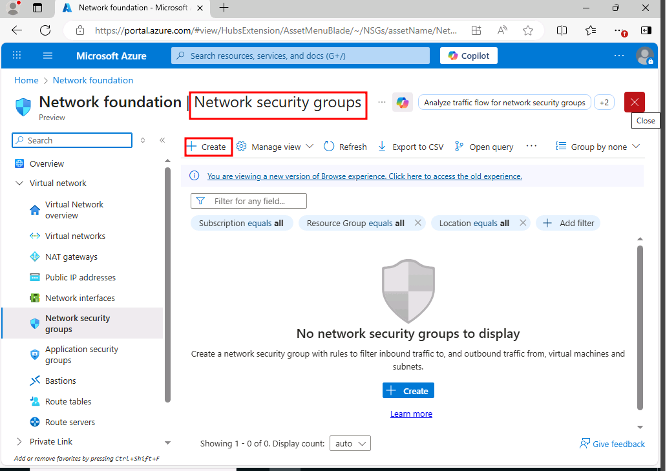

On the Create network security group blade, in Project details, in Resource group, select corp-datalod57908754.  
- In Instance details, in Name, enter webNSG.  
- Select Review + create, review the configuration, and then select Create.  

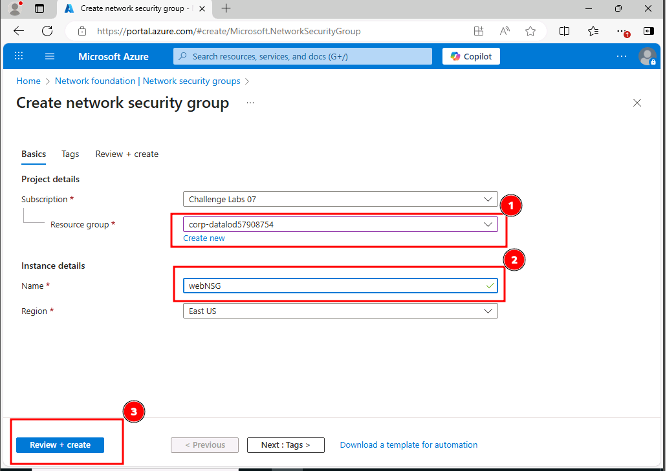

Want to learn more? Review the following documentation:
- Network security groups
- Creating a network security group

**Add an inbound security rule to webNSG to allow HTTP and HTTPS traffic by using the values in the following table. For any property that is not specified, use the default value.**

On the Deployments blade, select Go to resource.  
- On the webNSG service menu, in Settings, select Inbound security rules, and then on the command bar, select Add.

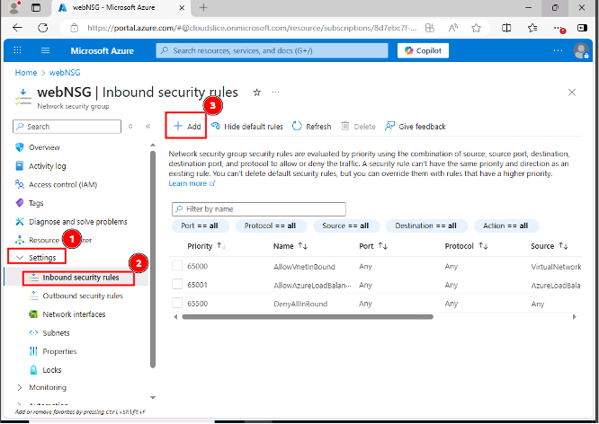

- On the Add inbound security rule blade, in Destination, select Application security group, and then in Destination application security groups, select webASG.  

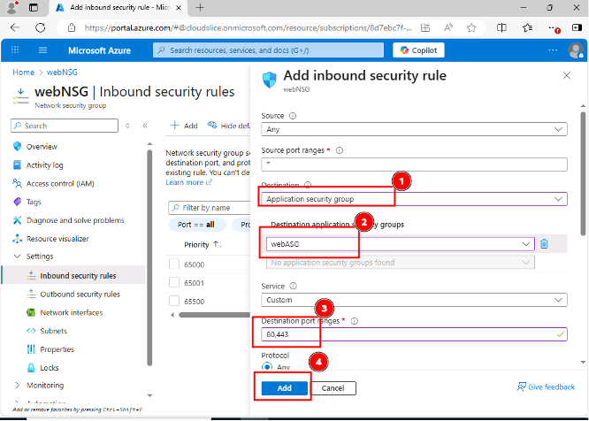

**Want to learn more? Review the documentation on creating security rules.**  
**Wait for the new inbound security rule to be created. This will take approximately 1-2 minutes.**  

Add a second inbound security rule to webNSG to allow RDP traffic by using the values in the following table. For any property that is not specified, use the default value.  

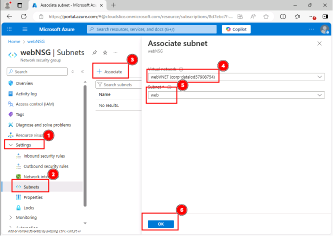

**Want to learn more? Review the documentation on associating a network security group.**
**Wait for the webNSG to be associated with the web subnet. This may take approximately 1-2 minutes.**

## Create an Azure virtual machine

**Create an Azure virtual machine by using the values in the following table. For any property that is not specified, use the default value.**

On the Azure portal menu, select Create a resource.  
- In the marketplace, search for and select Virtual machine, and then select the Virtual machines tile.
- On the Virtual machine blade, select Create.
- On the Create a virtual machine blade, on the Basics page, in Project details, in Resource group, select corp-datalod57908754.
- In Instance details, in Virtual machine name, enter vm1.
- In Availability options, select No infrastructure redundancy required.
- In Image, select Windows Server 2019 Datacenter - x64 Gen2.
- In Size, select See all sizes.
- On the Select a VM size blade, in Search by VM size, enter B2as, in VM Size, in Most used by Azure users, select B2as_v2, and then select Select.  

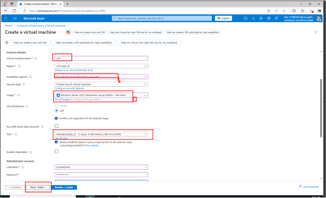

- On the Basics page, in Administrator account, in Username, enter AzureAdmin, and then in Password and Confirm password, enter Az!57908754!.
- In Inbound port rules, in Public inbound ports, select None.
- Select the Networking tab, and then in Network interface, in Virtual network, ensure that webVNET is selected.
- In Subnet, ensure that web (10.10.0.0/25) is selected, and then in NIC network security group, ensure that None is selected.

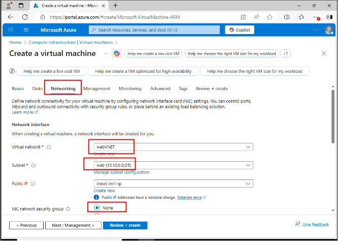

- Select the Monitoring tab, and then in Diagnostics, in Boot diagnostics, select Disable.  
- Select Review + create, review the virtual machine specifications, and then select Create.  

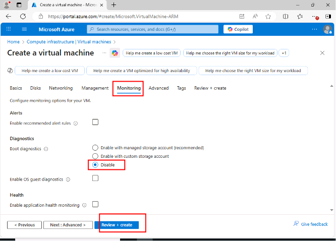

Want to learn more? Review the documentation on three methods of creating Azure virtual machines:
- Azure portal
- Azure PowerShell®
- Azure CLI 2.0

**Ignore any warnings about RDP ports as this virtual machine is only being used for testing.**
**The deployment will take approximately 3-5 minutes.**

Associate the webASG application security group with the vm1 virtual machine NIC.  
On the Deployment blade, select Go to resource.  
- On the vm1 service menu, in Networking, select Application security groups.
- On the Application security groups page, select Add application security group

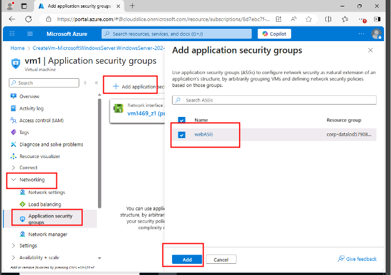

On the Add application security groups blade, select webASG, and then select Add.
Want to learn more? Review the documentation on associating an application security group.
It will take approximately 1-2 minutes to save the network settings in the background.

Connect to vm1 through RDP by using the values in the following table. For any property that is not specified, use the default value.

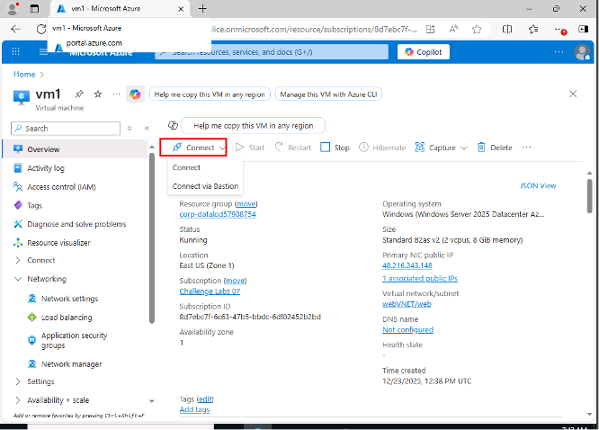

On the vm1 Overview page, on the command bar, select Connect, and then select Connect.
- On the Connect page, in the Native RDP tile, select Download RDP file.
- On the Connect page, in IP address, ensure that Public IP address is selected, and then select Download RDP File.

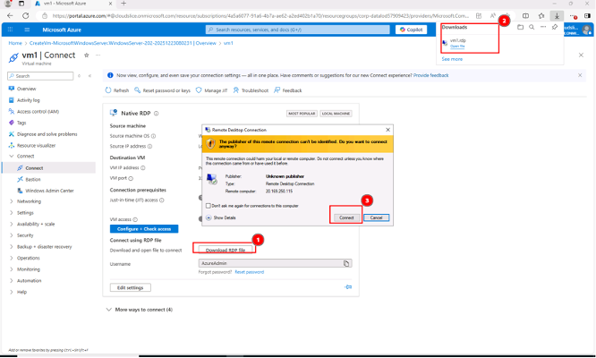

- Open the RDP file, and then in the Remote Desktop Connection window, select Connect.  
- When prompted for credentials, select More choices, and then select Use a different account.  
- In User name, ensure that AzureAdmin is displayed, in Password, enter Az!57908754!, and then select OK.  

•	In the Remote Desktop Connection dialog, select Yes, and then wait for the RDP session to initialize.
•	In the RDP session, if prompted to allow your PC to be discoverable by other PCs and devices on this network, select No, and then minimize Server Manager.

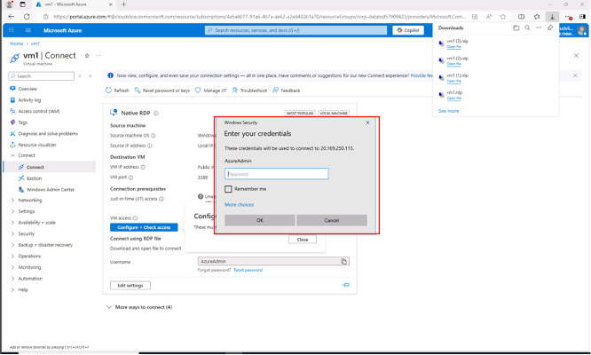

Install the Web Server (IIS) role in vm1 by using the Install-WindowsFeature Windows PowerShell cmdlet, and then close the RDP connection.
In the Remote Desktop Connection window, on the Start menu, select Windows PowerShell.
- In Windows PowerShell, run the following command to install IIS on vm1:  

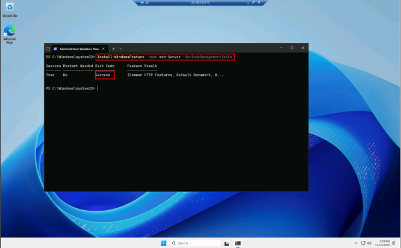

Verify that the IIS installation was successful.
- Close the Remote Desktop Connection window, and then select OK to disconnect.
Want to learn more? Review the documentation on the Install-WindowsFeature cmdlet.  

You should see the default Internet Information Services (IIS) webpage. This will verify that web traffic has been routed correctly by using an application security group and a network security group.

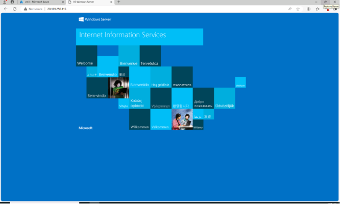

## Summary
Congratulations, you have completed the Configure an Application Security Group Challenge Lab.
You have accomplished the following:
- Created a virtual network for a web server tier.
- Created Azure security groups.
- Created an Azure virtual machine and tested application security.

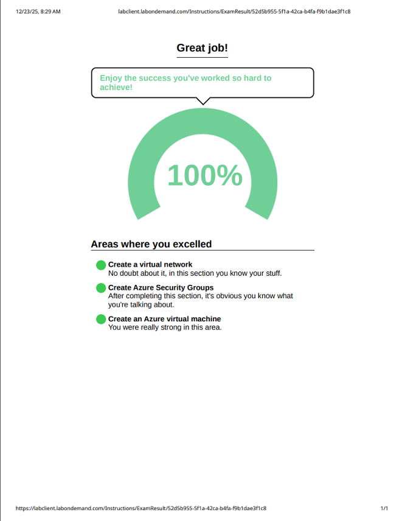

**December 18, 2025**

