# AZ-500: Secure compute, storage, and databases

## Can You Harden Virtual Machines in Azure? [Advanced]

### Understand the scenario.  

You are a Security Engineer for Hexelo, an organization that needs to create an Azure® virtual machine that adheres to security best practices.  
In this Challenge Lab, you will harden an Azure virtual machine. First, you will create a virtual network, and then you will create a network security group. Next, you will create an application security group, and then you will create an Azure virtual machine. Finally, you will create an Azure key vault, and then you will enable Azure Disk Encryption.  

### Create an Azure virtual network by using a network security group.  

Create a virtual network in the Azure portal by using the values in the following table. For any property that is not specified, use the default value.  

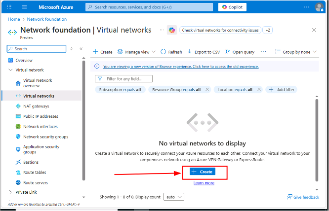.

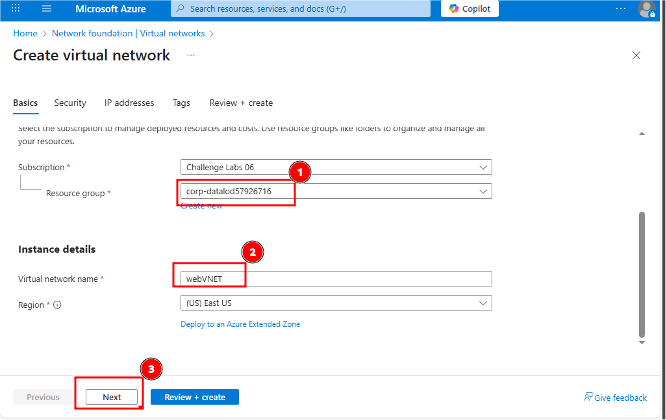.

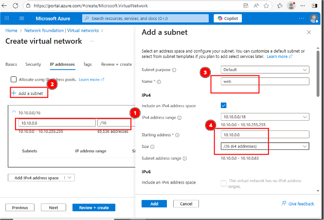.

Want to learn more? Review the documentation on creating a virtual network.  

Create a network security group named webNSG in the corp-datalod57926716 resource group.  

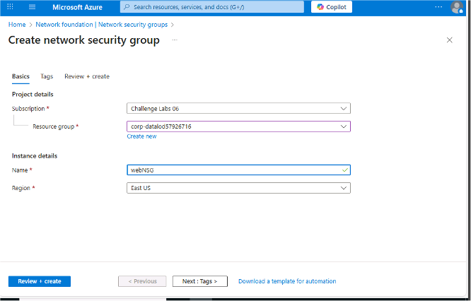.

Want to learn more? Review the documentation on creating a network security group.  

Associate the webNSG network security group to the web subnet in the webVNET virtual network.  

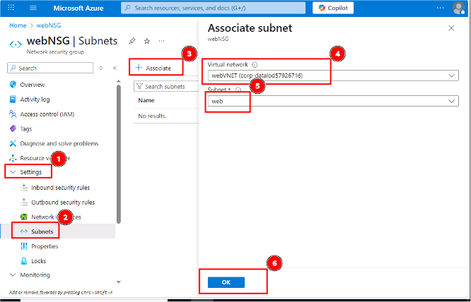.

Want to learn more? Review the documentation on associating a network security group to a subnet.  

Deploy an Azure virtual machine for a web app by using an application security group. 

Create an application security group named webASG in the corp-datalod57926716 resource group. 

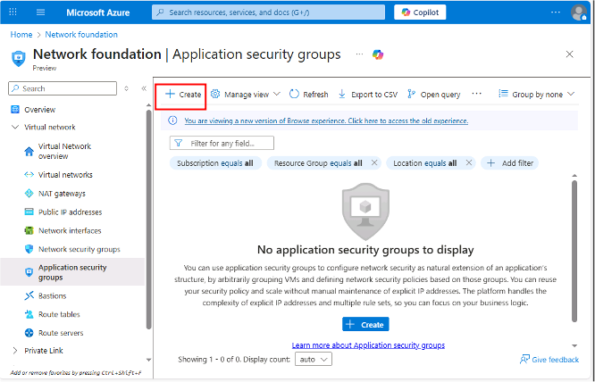.

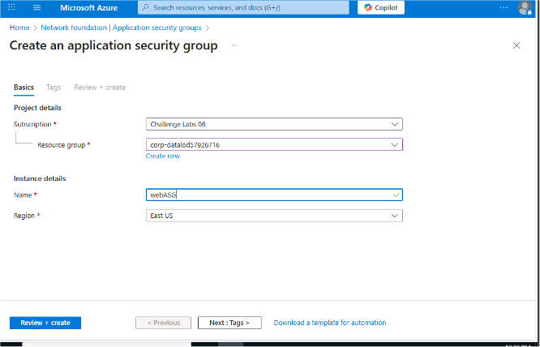.

Want to learn more? Review the documentation on creating an application security group.  

Create an Azure virtual machine for the web tier by using the values in the following table. For any property that is not specified, use the default value.  

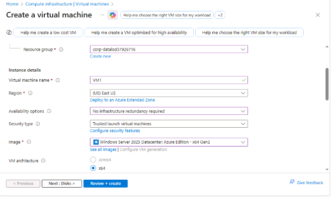.

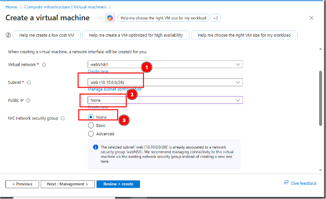.

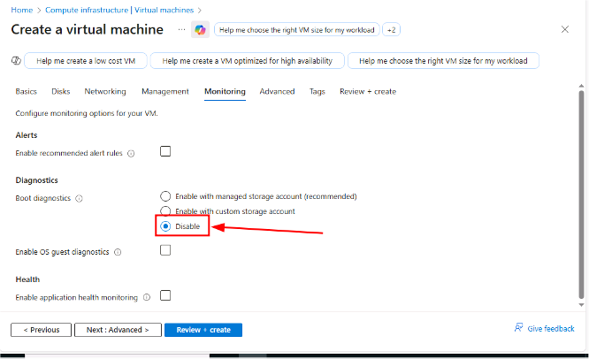.

Ignore any warnings about RDP ports as this virtual machine is being used for testing only.
The deployment will take 3-5 minutes.

Want to learn more? Review the documentation on creating a virtual machine.  

Associate the VM1 virtual machine network interface to the webASG application security group.  

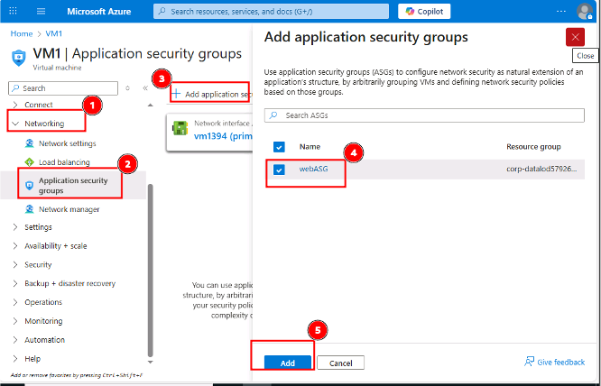.

## Enable web connectivity by using an application security group

Add an inbound security rule to webNSG to allow HTTP and HTTPS traffic by using the values in the following table. For any property that is not specified, use the default value.  

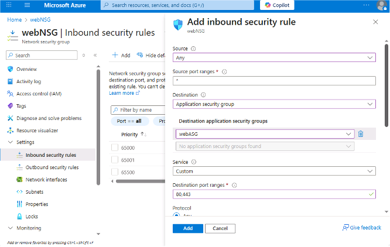.

Want to learn more? Review the documentation on creating an inbound security rule.  

Add a second inbound security rule to webNSG to allow RDP traffic by using the values in the following table. For any property that is not specified, use the default value.   
 
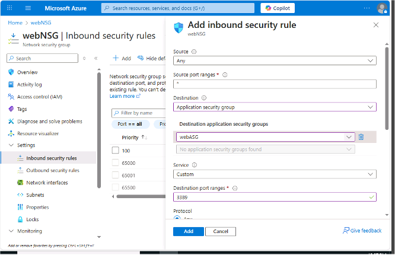.

Connect to VM1 by using RDP and the values in the following table. For any property that is not specified, use the default value.  

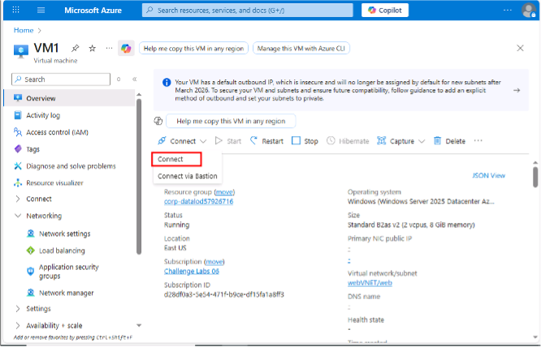.

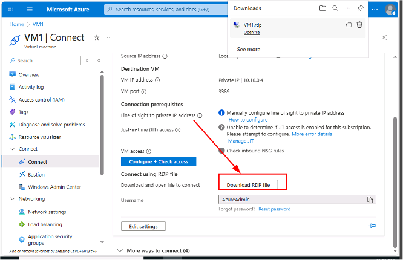.

In the RDP session for VM1, install the Web Server (IIS) role by using the Install-WindowsFeature Windows PowerShell® cmdlet.  

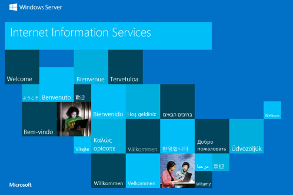.

## Enable Azure Disk Encryption

Create an Azure key vault by using the values in the following table. For any property that is not specified, use the default value.  

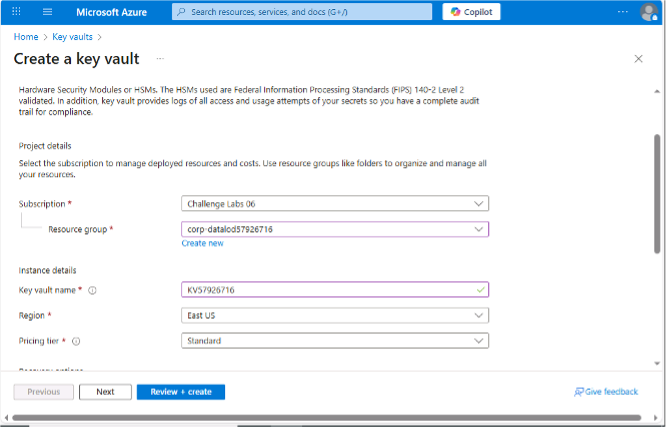.

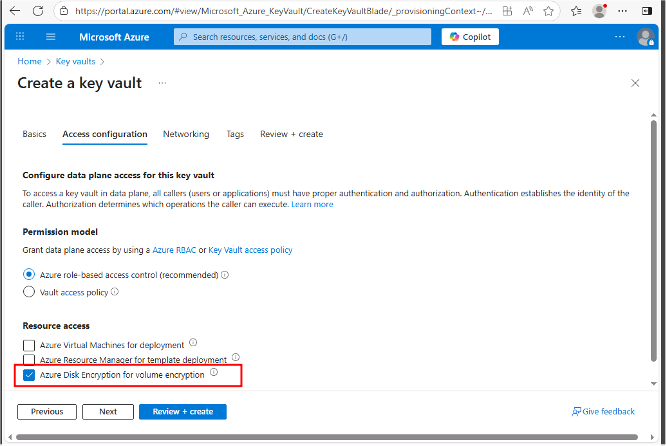.

Want to learn more? Review the documentation on creating an Azure key vault.  

Open an Azure Cloud Shell PowerShell session without mounting a storage account and using the existing subscription
Retrieve the properties of the KV57926716 key vault in the corp-datalod57926716 resource group storing the results in a local variable named $KeyVault by using the Get-AzKeyVault cmdlet.  

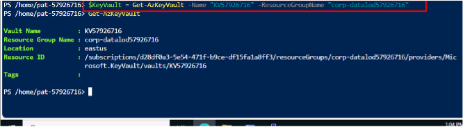.

Enable Azure Disk Encryption on VM1 in the corp-datalod57927672 resource group by using the Set-AzVMDiskEncryptionExtension PowerShell cmdlet and the appropriate properties of the $KeyVault variable.

Verify that encryption on VM1 has been enabled by using the Get-AzVmDiskEncryptionStatus cmdlet.

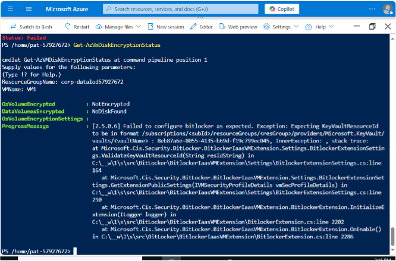.

Want to learn more? Review the documentation on the Get-AzVmDiskEncryptionStatus cmdlet.  

## Summary. 
Congratulations, you have completed the Can You Harden Virtual Machines in Azure? Challenge Lab.
You have accomplished the following:  

- Created an Azure virtual network by using a network security group.
- Deployed an Azure virtual machine for a web app by using an application security group.
- Enabled web connectivity by using an application security group.
- Enabled Azure Disk Encryption.

[sreenshot](../imagesw/images41/21.png).

**December 12, 2025**

