# AZ-500: Secure identity and access

## Can You Enable Secure Virtual Machines and Application Services? [Advanced]

**Understand the scenario**  

You are an Administrator for Hexelo, an organization that needs to secure its Azure® environment.   
In this Challenge Lab, you will enable secure virtual machines and application services. First, you will create a virtual machine, and then you will install the Microsoft Antimalware extension. Next, you will deny RDP traffic for the virtual machine, and then you will enable Azure Disk Encryption. Finally, you will deploy a Web App, and then you will enable Application Insights for security monitoring.  

Create an Azure virtual machine.  

Create an Azure virtual machine by using the values in the following table. For any property that is not specified, use the default value.  

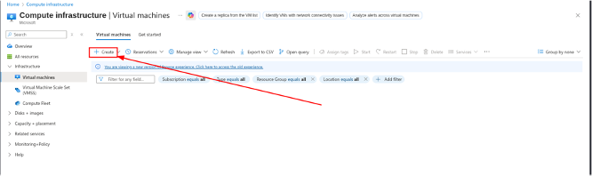.

.

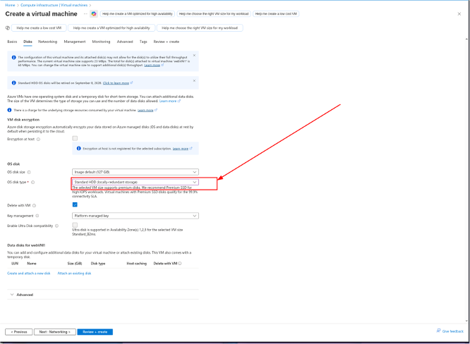.

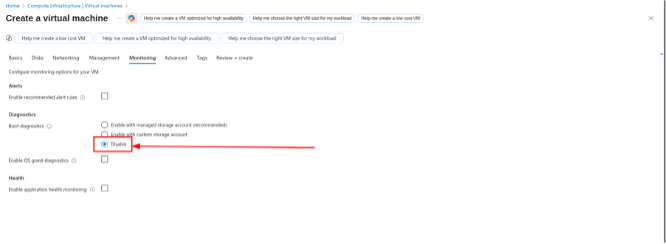.

**Want to learn more? Review the documentation on creating a virtual machine.**. 

Ignore any warnings about RDP ports as this virtual machine is being used for testing only.  
The deployment should take approximately 2-3 minutes. Wait for the deployment to complete before moving on to the next task.  

Enable recommended security features. 

Install the Microsoft Antimalware extension on webVM1 by using the default settings.  

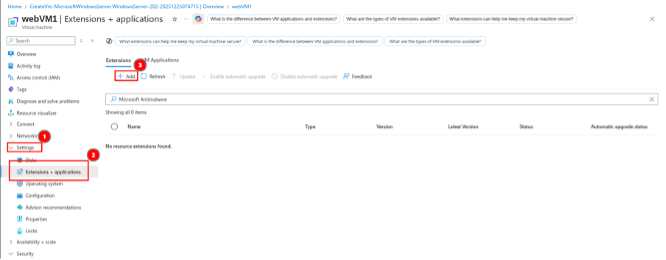.

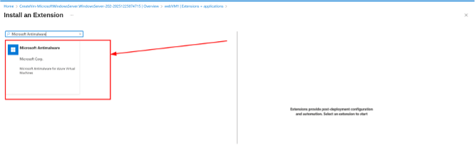.

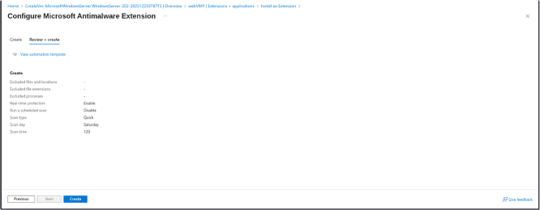.

**Want to learn more? Review the documentation on adding the Microsoft Antimalware extension.**

Delete the RDP inbound security rule in the webVM1-nsg network security group to deny RDP traffic for webVM1.  

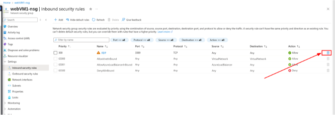.

**Want to learn more? Review the documentation on deleting an inbound security rule.** 

Create an Azure key vault by using the values in the following table. For any property that is not specified, use the default value.  

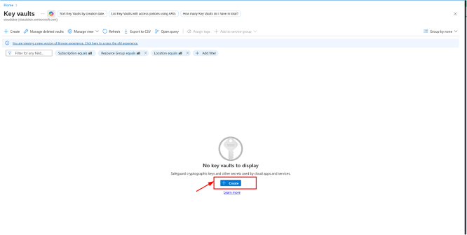.

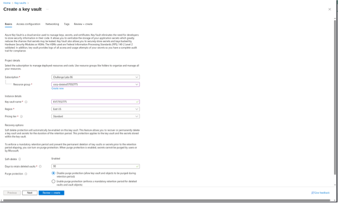.

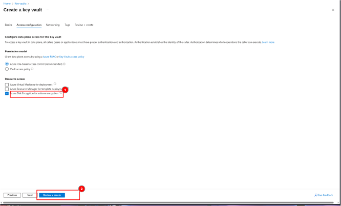.

**Want to learn more? Review the documentation on creating an Azure key vault.**. 

Use Azure Disk Encryption (ADE) to encrypt the OS disk on the webVM1 virtual machine by using a new key named BEK1 in the KV57932775 key vault.  

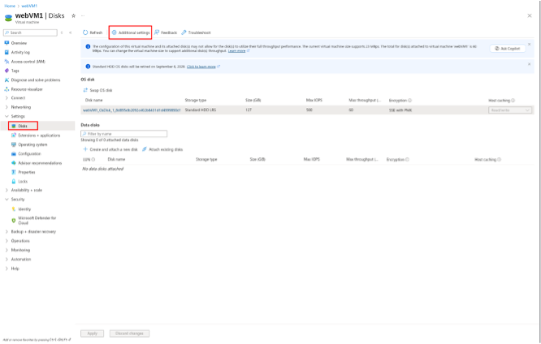.

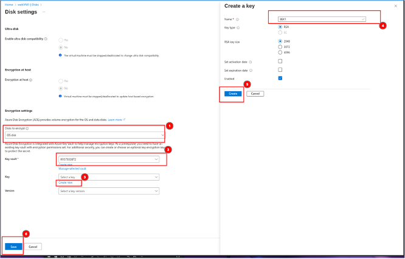.

**Enable Application Insights to monitor security.**

Create an Azure Web App by using the values in the following table. For any property that is not specified, use the default value.  

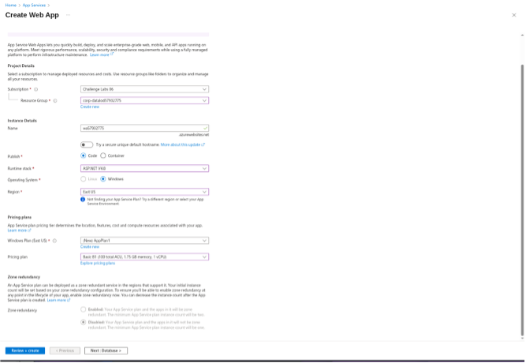.

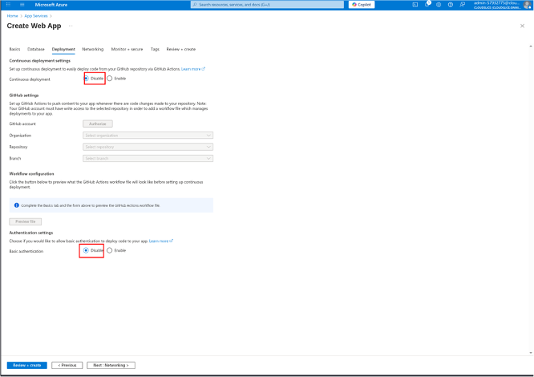.

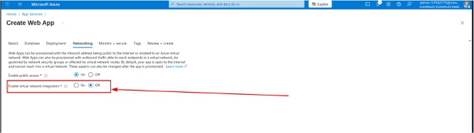.

It is important that you enable Basic authentication; otherwise, you will not be able to deploy code later. In the Web App blade, in Configuration, the setting is named SCM Basic Auth Publishing Credentials.  

In a new browser tab, go to the URL for the new Web App at https://wa57932775.azurewebsites.net to verify that it is up and running.  

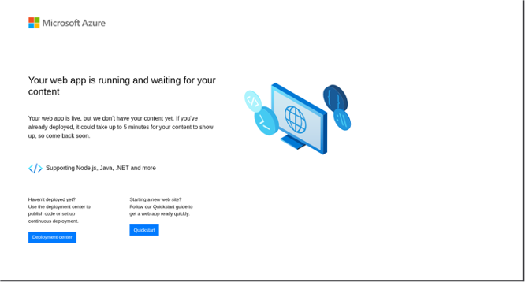.

Deploy the source code for the wa57932775 Web App by using the values in the following table. For any property that is not specified, use the default value.   

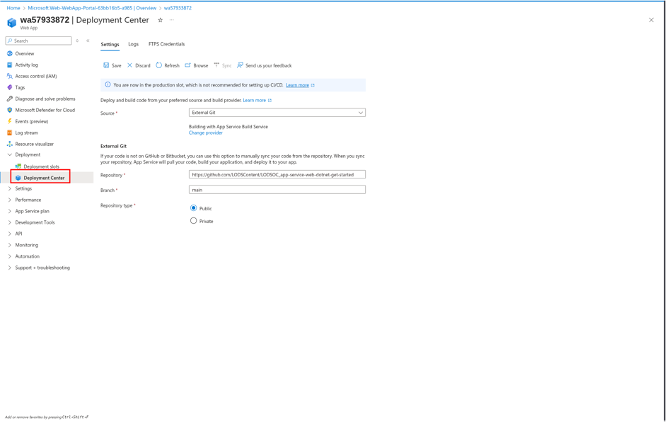.

Want to learn more? Review the documentation on deploying source code to a Web App.  

In a new browser tab, go to the URL for the Web App at https://wa57933872.azurewebsites.net to verify that it is up and running.  
You should see an updated home page. It may take a minute for the home page to display for the first time after code deployment.  

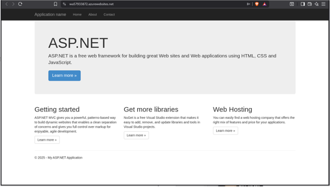.

If you do not see the updated page, refresh the browser.  
Enable Application Insights for the wa57933872 Web App by using the new resource name wa57933872 and the laws-57933872 Log Analytics Workspace.  

.

You may have to wait 1-2 minutes for Application Insights to fully enable.  
Want to learn more? Review the documentation on enabling Application Insights for a Web App.  
Display the Applications Insights data, and then open the Live Stream tile to display the Live metrics chart on the Application Dashboard for the wa57933872 Web App.  
Want to learn more? Review the documentation on using Application Insights for a Web App.  
Keep the Live metrics report open. You will use this to display requests in an upcoming task.  
In a new browser window, go to the URL for the Web App at https://wa57933872.azurewebsites.net, and then refresh the browser a few times to generate valid requests.  

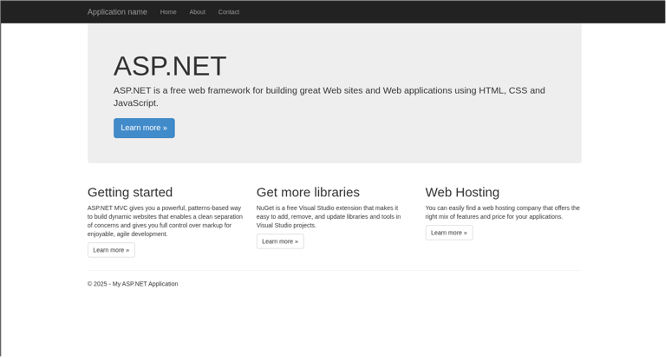.

Generate a failed request for the Web App by using the URL https://wa57933872.azurewebsites.net/default.  

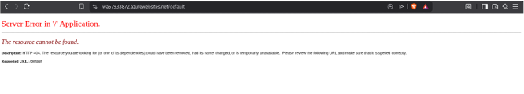.

Return to the Live metrics chart, and then review the successful and failed requests. 

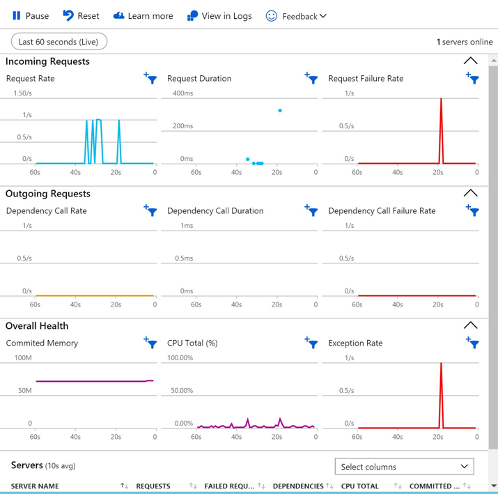.

### Summary. 

Congratulations, you have completed the Can You Enable Secure Virtual Machines and Application Services? Challenge Lab.
You have accomplished the following:  
- Created an Azure virtual machine.
- Installed the Microsoft Antimalware extension.
- Denied RDP access to a virtual machine.
- Enabled Azure Disk Encryption.
- Enabled Application Insights to monitor security.

**December 28, 2025**

