# Cloud Security Specialist CSS (AZ-500). 

## AZ-500: Secure networking. 

## Can You Configure Network Security to Allow Application Traffic? [Advanced]. 

**Understand the scenario**. 

You are a Security Engineer for Hexelo, an organization that needs to secure its Azure® network traffic.
In this Challenge Lab, you will configure a secure network that contains multiple Azure virtual machines in a multi-tier architecture. First, you will create a virtual network for each tier, and then you will implement peering for internal communication. Next, you will create a virtual machine for each tier. Finally, you will configure a network security group (NSG) for the web tier, and then you will test the configuration.  

Configure peering between virtual networks. 

Create a virtual network for the web tier by using the values in the following table. For any property that is not specified, use the default value.  

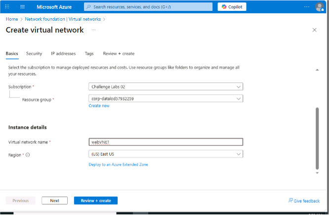.

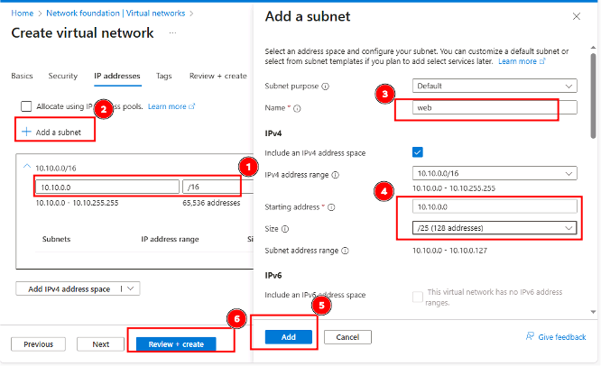.

Want to learn more? Review the documentation on creating virtual networks.

Create a virtual network for the application tier by using the values in the following table. For any property that is not specified, use the default value.

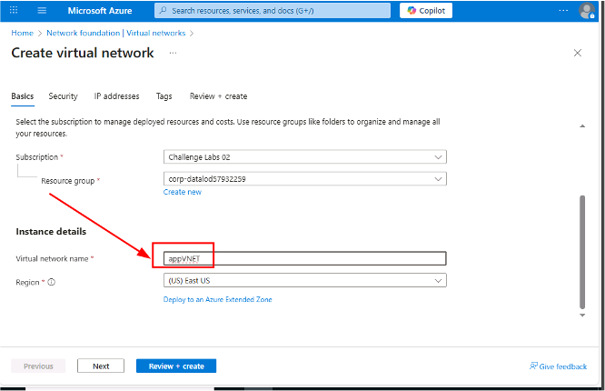.

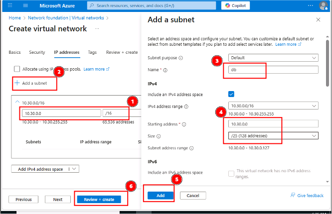.

Create a virtual network for the database tier by using the values in the following table. For any property that is not specified, use the default value

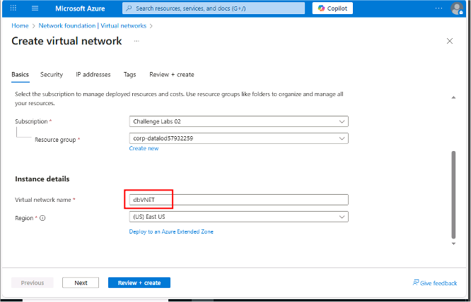.

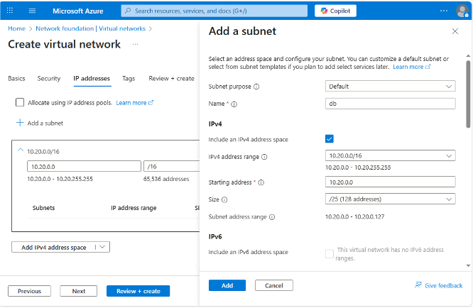.

Create virtual network peering connections from webVNET to appVNET by using the values in the following table. For any property that is not specified, use the default value.

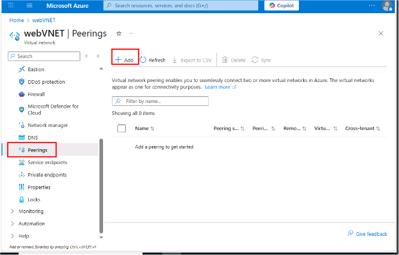.

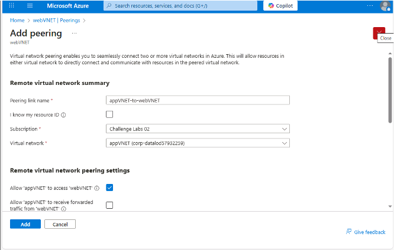.

**Want to learn more? Review the documentation on peering virtual networks.**

Create virtual network peering connections from appVNET to dbVNET by using the values in the following table. For any property that is not specified, use the default value.

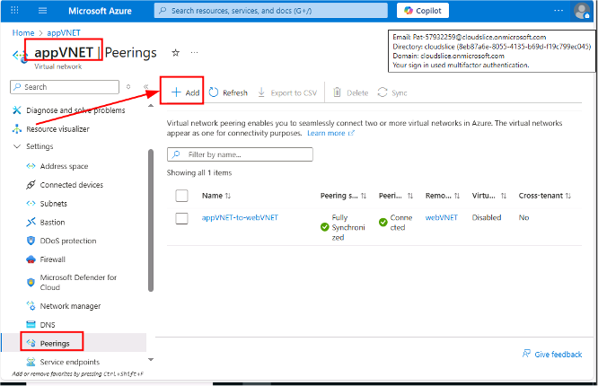.

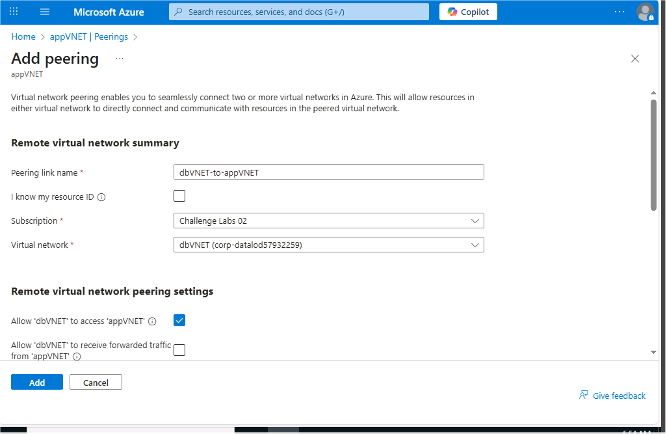.

## Create Azure virtual machines for a multi-tier app

Create an Azure virtual machine for the web tier by using the values in the following table. For any property that is not specified, use the default value.  

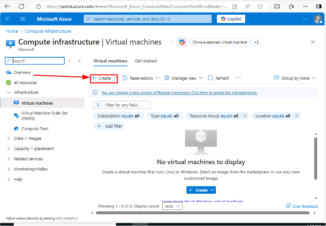.

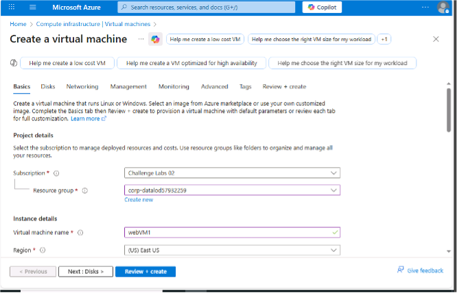.

.

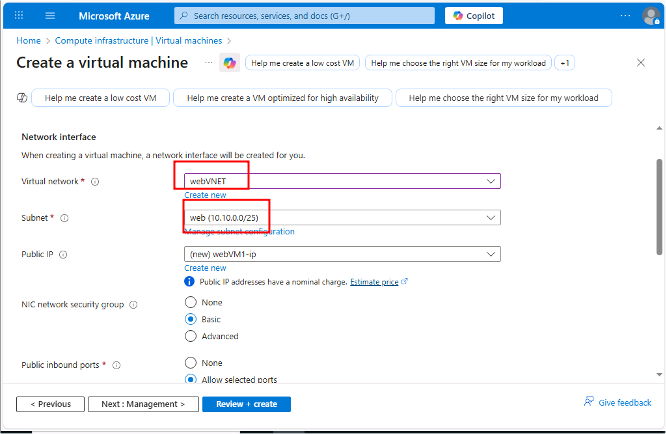.

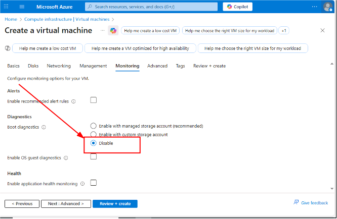.

**Want to learn more? Review the documentation on creating a virtual machine.**

Ignore any warnings about RDP ports as this virtual machine is being used for testing only. The deployment may take 5-10 minutes.

Create an Azure virtual machine for the application tier by using the values in the following table. For any property that is not specified, use the default value.

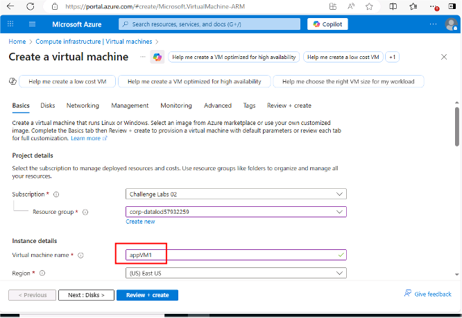.

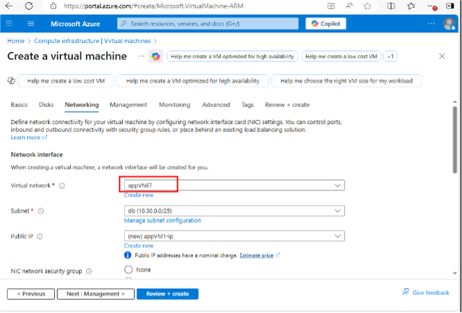.

Create an Azure virtual machine that hosts SQL Server 2019 on Windows Server 2019 by using the values in the following table. For any property that is not specified, use the default value.

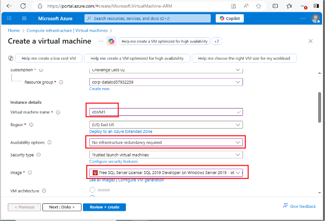.

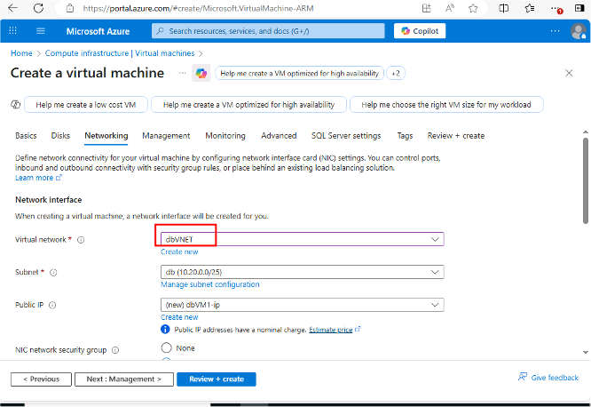.

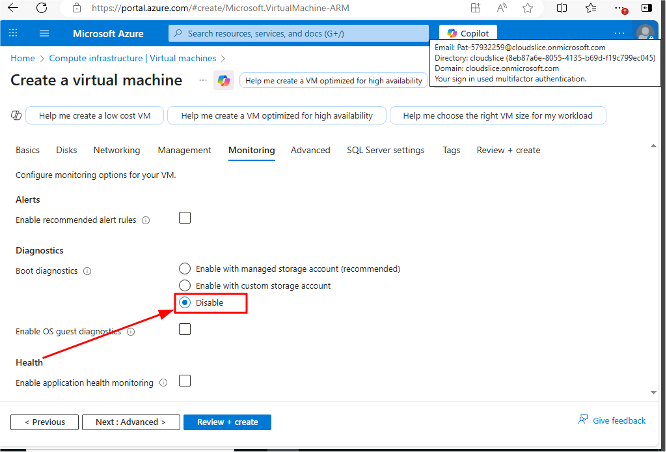.

**December 30, 2025**