# Cloud Security Specialist CSS (AZ-500). 


## Azure Monitor, Microsoft Defender for cloud, Enable Just-In Time Access in VMs, Microsoft Sentinel   

**Lab 08: Create a Log Analytics Workspace, Azure Storage Account, and Data Collection Rule (DCR)**  

Student lab manual. 
**Lab scenario**  

As an Azure Security Engineer for a financial technology company, you are tasked with enhancing monitoring and security visibility across all Azure virtual machines (VMs) used for processing financial transactions and managing sensitive customer data. The security team requires detailed logs and performance metrics from these VMs to detect potential threats and optimize system performance. The Chief Information Security Officer (CISO) has asked you to implement a solution that collects security events, system logs, and performance counters. You have been assigned to configure the Azure Monitor Agent (AMA) along with Data Collection Rules (DCRs) to centralize log collection and performance monitoring.

For all the resources in this lab, we are using the East US region. Verify with your instructor this is the region to use for class.
Lab objectives. 

In this lab, you will complete the following exercises:  
- Exercise 1: Deploy an Azure virtual machine. 
- Exercise 2: Create a Log Analytics workspace. 
- Exercise 3: Create an Azure storage account. 
- Exercise 4: Create a data collection rule. 

**Instructions**
### Exercise 1: Deploy an Azure virtual machine. 

In this exercise, you will complete the following tasks:   
Task 1: Deploy an Azure virtual machine. 
1.	Sign-in to the Azure portal https://portal.azure.com/.
Sign in to the Azure portal using an account that has the Owner or Contributor role in the Azure subscription you are using for this lab. In this Cloudslice lab, this account is LabUser-57986070@LODSPRODMCA.onmicrosoft.com with TAP a@f6&Kvf.  
2.	Open the Cloud Shell by clicking the first icon in the top right of the Azure Portal. If prompted, select PowerShell.  
3.	Ensure PowerShell is selected in the drop-down menu in the upper-left corner of the Cloud Shell pane.  
4.	In the Getting started window, leave the default setting as is: Select a subscription to get started. You can optionally mount a storage account to persist files between sessions. No storage account required.  
5.	From the Subscription drop-down menu, select your lodsubscription.  
6.	Leave Use an existing private virtual network unchecked, then click Apply.  
7.	In the PowerShell session within the Cloud Shell pane, run the following to create a resource group that will be used in this lab:
powershellTypeCopy. 

New-AzResourceGroup -Name AZ500LAB131415 -Location 'EastUS'. 
This resource group will be used for labs 8, 9, and 10.  
8.	In the PowerShell session within the Cloud Shell pane, run the following to enable encryption at host (EAH)
powershellTypeCopy. 
Register-AzProviderFeature -FeatureName "EncryptionAtHost" -ProviderNamespace Microsoft.Compute
9.	In the PowerShell session within the Cloud Shell pane, run the following to create a new Azure virtual machine.
powershellTypeCopy. 
New-AzVm -ResourceGroupName "AZ500LAB131415" -Name "myVM" -Location 'EastUS' -VirtualNetworkName "myVnet" -SubnetName "mySubnet" -SecurityGroupName   "myNetworkSecurityGroup" -PublicIpAddressName "myPublicIpAddress" -PublicIpSku Standard -OpenPorts 80,3389 -Size Standard_D2s_v3. 
10.	When prompted for credentials:  
Setting	Value. 

**User	localadmin**
**Password	Please use your personal password created in Lab 02 > Exercise 2 > Task 1 > Step 3.**
**Wait for the deployment to complete.**

11.	In the PowerShell session within the Cloud Shell pane, run the following to confirm that the virtual machine named myVM was created and its ProvisioningState is Succeeded.

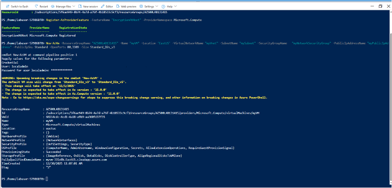.

powershellTypeCopy
```
Get-AzVM -Name 'myVM' -ResourceGroupName 'AZ500LAB131415' | Format-Table
```

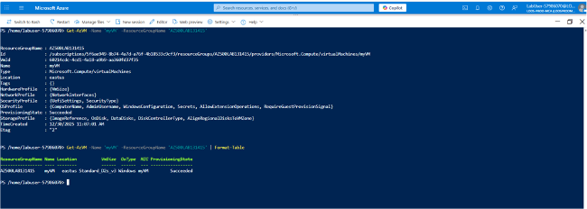.

12.	Close the Cloud Shell pane.  
### Exercise 2: Create an Log Analytics workspace

Task 1: Create a Log Analytics workspace. 
In this task, you will create a Log Analytics workspace.  
1.	In the Azure portal, in the Search resources, services, and docs text box at the top of the Azure portal page, type Log Analytics workspaces and press the Enter key.  
2.	On the Log Analytics workspaces blade, click + Create.  
3.	On the Basics tab of the Create Log Analytics workspace blade, specify the following settings (leave others with their default values):  

Setting	Value
Subscription	the name of the Azure subscription you are using in this lab. 
Resource group	AZ500LAB131415
Name	LAW57986070
Region	East US

4.	Select Review + create.   

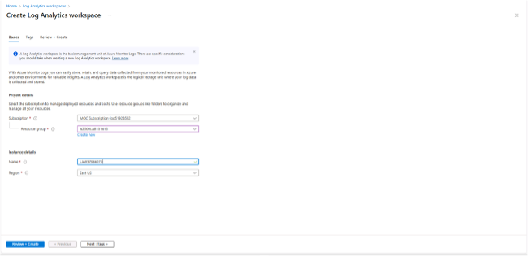

5.	On the Review + create tab of the Create Log Analytics workspace blade, select Create.  


### Exercise 3: Create an Azure storage account.  

In this exercise, you will complete the following tasks:   

**Task 1: Create an Azure storage account**. 

In this task, you will create a storage account.   
1.	In the Azure portal, in the Search resources, services, and docs text box at the top of the Azure portal page, type Storage accounts and press the Enter key.   
2.	On the Storage accounts blade in the Azure portal, click the + Create button to create a new storage account.  

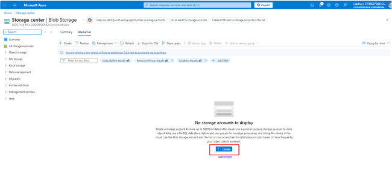.  

3.	On the Basics tab of the Create storage account blade, specify the following settings (leave others with their default values):  

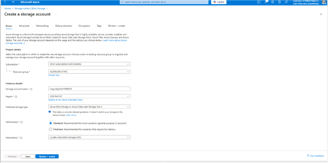.  

Setting	Value. 
Subscription	the name of the Azure subscription you are using in this lab. 

| Resource Group       | Instance Details | Storage Account Name      | Region      | Primary Service                        | Performance                     | Redundancy                       |
|---------------------|-----------------|--------------------------|------------|----------------------------------------|---------------------------------|----------------------------------|
| AZ500LAB131415       |                 | strgactignite57986070    | (US) EastUS| Azure Blob Storage / Data Lake Gen 2   | Standard (general-purpose v2)  | Locally redundant storage (LRS) |

4.	On the Basics tab of the Create storage account blade, click Review + create. After the validation process completes, click Create.
Wait for the Storage account to be created. This should take about 2 minutes.  

Create a Data Collection Rule. 

In this exercise, you will complete the following tasks:  
Task 1: Create a Data Collection Rule.  
In this task, you will create a data collection rule.  

1.	In the Azure portal, in the Search resources, services, and docs text box at the top of the Azure portal page, type Monitor and press the Enter key.  
2.	On the Monitor Settings blade, click Data Collection Rules.  
3.	Click the + Create button to create a new data collection rule.  

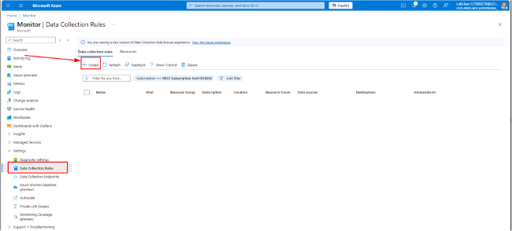. 

4.	On the Basics tab of the Create Data Collection Rule blade, specify the following settings:
Setting	Value

| Rule Name | Subscription                         | Resource Group      | Region   | Platform Type | Data Collection Endpoint |
|-----------|--------------------------------------|-------------------|---------|---------------|-------------------------|
| DCR1      | The name of the Azure subscription   | AZ500LAB131415     | East US | Windows       | Leave Blank             |

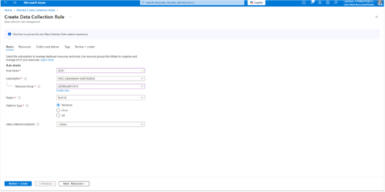. 

5.	Click on the button labeled Next: Resources > to proceed.  
6.	On the Resources page, select + Add resources.  
7.	In the Select a scope template, check the Subscription box in the Scope.  
8.	At the bottom of the Select a scope template, click Apply.  

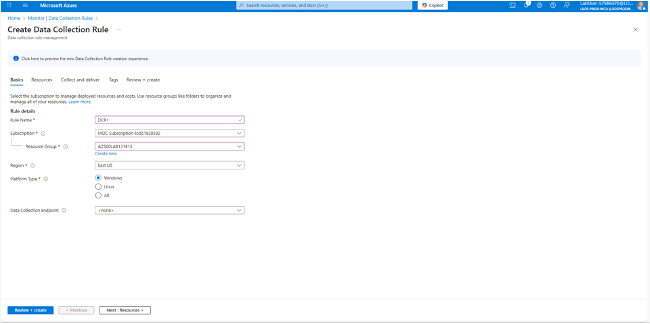.

9.	At the bottom of the Resources page, select Next: Collect and deliver >.
10.	Click + Add data source, then on the Add data source page, change the Data source type drop-down menu to display Performance Counters. Leave the following default settings:

| Setting           | Value |
|------------------|-------|
| CPU               | 60    |
| Memory            | 60    |
| Disk              | 60    |
| Network           | 60    |

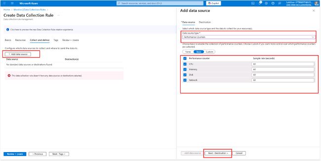.

11.	Click on the button labeled Next: Destination > to proceed.  
12.	Click + Add destination, change the Destination type drop-down menu to display Azure Monitor Logs. In the Subscription window, ensure that your Subscription is displayed, then change the Account or namespace drop-down menu to reflect your previously created Log Analytics Workspace.   

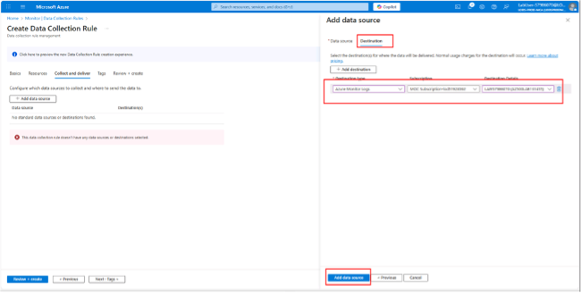.

13.	Click on Add data source at the bottom of the page.  

14.	Click Review + create.  

Results: You deployed an Azure virtual machine, Log Analytics workspace, Azure storage account, and a data collection rule to collect events and performance counters from virtual machines with Azure Monitor Agent.

Do not remove the resources from this lab, as they are needed for the Microsoft Defender for Cloud lab, the 'Enable just-in-time access on VMs' lab, and the Microsoft Sentinel lab. 


## Configuring Microsoft Defender for Cloud Enhanced Security Features for Servers. 

**Lab scenario**

As an Azure Security Engineer for a global e-commerce company, you are responsible for securing the company’s cloud infrastructure. The organization relies heavily on Azure virtual machines (VMs) and on-premises servers to run critical applications, manage customer data, and process transactions. The Chief Information Security Officer (CISO) has identified the need for enhanced security measures to protect these resources against cyber threats, vulnerabilities, and misconfigurations. You have been tasked with enabling Microsoft Defender for Servers in Microsoft Defender for Cloud to provide advanced threat protection and security monitoring for both Azure VMs and hybrid servers.  

Lab objectives. 

•	Configure Microsoft Defender for Cloud Enhanced Security Features for Servers. 
•	Review the enhanced security features for Microsoft Defender for Servers Plan 2. 

**Exercise instructions**. 
Configure Microsoft Defender for Cloud Enhanced Security Features for Servers. 
1.	In the Azure portal, in the Search resources, services, and docs text box at the top of the Azure portal page, type Microsoft Defender for Cloud and press the Enter key.  
2.	On the Microsoft Defender for Cloud, Management blade, go to the Environment settings. Expand the environment settings folders until the subscription section is displayed, then click the subscription to view details.  

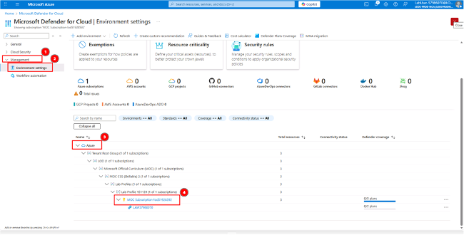.


In the Settings blade, under Defender plans, expand Cloud Workload Protection (CWPP).  
1.	From the Cloud Workload Protection (CWPP) Plan list, select Servers. On the right side of the page, change the Status from Off to On, then click Save.  

.

2.	To review the details of Microsoft Defender for Servers Plan 2, select Change plan >.  

**Note: Enabling the Cloud Workload Protection (CWPP) Servers plan from Off to On enables Microsoft Defender for Servers Plan 2.**

Results: You have enabled Microsoft Defender for Servers Plan 2 on your subscription.  


## Enable just-in-time access on VMs

**Lab scenario** 

As an Azure Security Engineer at a financial services company, you're responsible for securing Azure resources, including virtual machines (VMs) that host critical applications. The security team has identified that continuous open access to VMs increases the risk of brute-force attacks and unauthorized access. To mitigate this, the Chief Information Security Officer (CISO) has requested that you enable Just-in-Time (JIT) VM access on a specific Azure VM used for processing financial transactions.  

**Lab objectives** 

In this lab, you will complete the following exercises:  
- Exercise 1: Enable JIT on your VMs from the Azure portal.   
- Exercise 2: Request access to a VM that has JIT enabled from the Azure portal.  

**Exercise instructions**. 

### Exercise 1: Enable JIT on your VMs from Azure virtual machines

If you receive the error Error enabling just-in-time access please note that it can take as long as 30 minutes or more for the backend processes to 'onboard' Microsoft Defender for Cloud such that this will succeed.  

You can enable JIT on a VM from the Azure virtual machines pages of the Azure portal.  
1.	In the search box at the top of the portal, enter virtual machines. Select Virtual machines in the search results.  
2.	Select myVM.  
3.	Select Configuration from the Settings section of myVM.  
4.	Under Just-in-time VM access, select Enable just-in-time.  

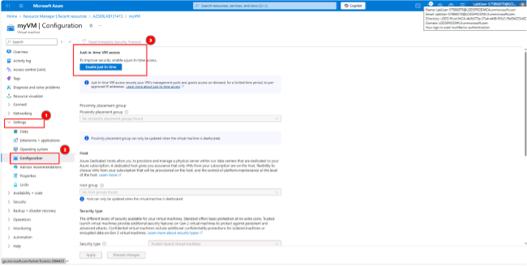.

5.	Under Just-in-time VM access, click on the link that reads Open Microsoft Defender for Cloud.  
6.	By default, just-in-time access for the VM uses these settings:  

	| Machine Type | Port | Maximum Allowed Access | Allowed Source IP Addresses |
|-------------|------|----------------------|----------------------------|
| Windows     | 3389 | 3 hours              | Any                        |
| Linux       | 22   | 3 hours              | Any                        |

7.	By default, just-in-time access for the VM uses these settings:  
- From the Configured tab, right-click on the VM to which you want to add a port, and select edit.  

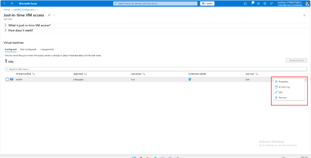.

- Under JIT VM access configuration, you can either edit the existing settings of an already protected port or add a new custom port.
- When you've finished editing the ports, select Save.  
Exercise 2: Request access to a JIT-enabled VM from the Azure virtual machine's connect page.
When a VM has a JIT enabled, you have to request access to connect to it. You can request access in any of the supported ways, regardless of how you enabled JIT.  

1.	In the Azure portal, open the virtual machines pages.
2.	Select the VM to which you want to connect, and open the Connect page.
- Azure checks to see if JIT is enabled on that VM.  
- If JIT isn't enabled for the VM, you're prompted to enable it.  

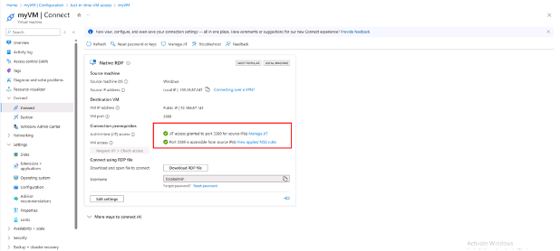.

- If JIT is enabled, select Request access to pass an access request with the requesting IP, time range, and ports that were configured for that VM.  

**Results: You have explored various methods on how to enable JIT on your VMs and how to request access to VMs that have JIT enabled in Microsoft Defender for Cloud.**


## Microsoft Sentinel

**Lab scenario** 

Note: Azure Sentinel is renamed to Microsoft Sentinel.  

You have been asked to create a proof of concept of Microsoft Sentinel-based threat detection and response. Specifically, you want to:
- Start collecting data from Azure Activity and Microsoft Defender for Cloud.  
- Add built in and custom alerts. 
- Review how Playbooks can be used to automate a response to an incident.  

For all the resources in this lab, we are using the East US region. Verify with your instructor this is the region to use for class.
Lab objectives. 

In this lab, you will complete the following exercise:  
### Exercise 1: Implement Microsoft Sentinel

Microsoft Sentinel diagram

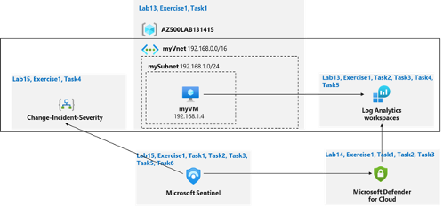.

### Implement Microsoft Sentinel

In this exercise, you will complete the following tasks:  
- Task 1: On-board Microsoft Sentinel. 
- Task 2: Connect Azure Activity to Sentinel   
- Task 3: Create a rule that uses the Azure Activity data connector.  
- Task 4: Create a playbook. 
- Task 5: Create a custom alert and configure the playbook as an automated response.   
- Task 6: Invoke an incident and review the associated actions. 

### Task 1: On-board Microsoft Sentinel. 
In this task, you will on-board Microsoft Sentinel and connect the Log Analytics workspace.  

In the Azure portal, in the Search resources, services, and docs text box at the top of the Azure portal page, type Microsoft Sentinel and press the Enter key.  

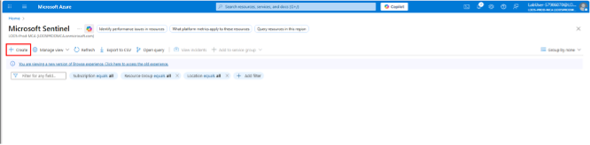.

On the Microsoft Sentinel blade, click + Create.  
1.	On the Add Microsoft Sentinel to a workspace blade, select the Log Analytics workspace you created in the Azure Monitor lab and click Add.  

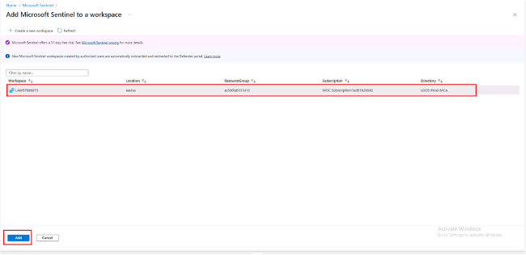.

**Microsoft Sentinel has very specific requirements for workspaces. For example, workspaces created by Microsoft Defender for Cloud can not be used. Read more at Quickstart: On-board Microsoft Sentinel**. 

### Task 2: Configure Microsoft Sentinel to use the Azure Activity data connector.  

In this task, you will configure Sentinel to use the Azure Activity data connector.  
1.	In the Azure portal, on the Microsoft Sentinel | Overview blade, in the Content management section, click Content hub.  
2.	On the Microsoft Sentinel | Content hub blade, review the list of available content.  

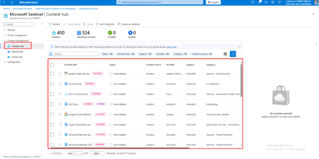.

3.	Type Azure into the search bar and select the entry representing Azure Activity. Review its description at the far right, and then click Install. 

.

4.	Wait for the Install Success notification. In the left navigation panel, in the Configuration section, click Data connectors.
5.	On the Microsoft Sentinel | Data connectors blade, click Refresh and review the list of available connectors. Select the entry representing the Azure Activity connector (hide the menu bar on the left using \<< if needed), review its description and status at the far right, and then click Open connector page.  

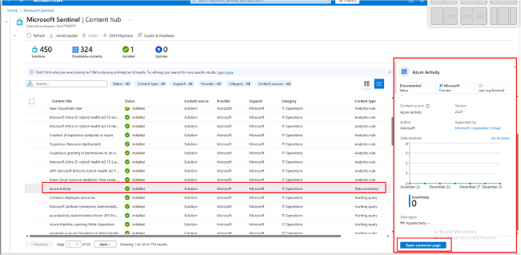.

6.	On the Azure Activity blade the Instructions tab should be selected, note the Prerequisites and scroll down to the Configuration. Take note of the information describing the connector update. Your subscription never used the legacy connection method so you can skip step 1 (the Disconnect All button will be grayed out) and proceed to step 2.  
7.	In step 2 Connect your subscriptions through diagnostic settings new pipeline, review the "Launch the Azure Policy Assignment wizard and follow the steps" instructions then click Launch the Azure Policy Assignment wizard>.  

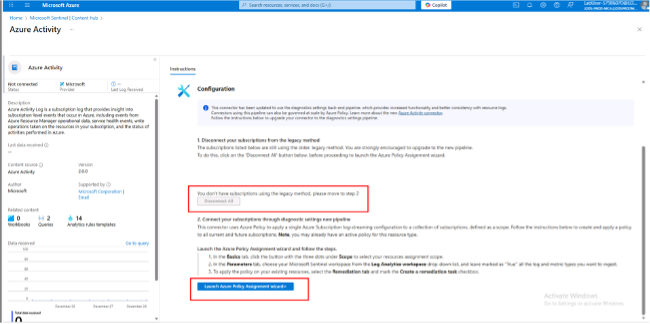.


8.	On the Configure Azure Activity logs to stream to specified Log Analytics workspace (Assign Policy page) Basics tab, click the Scope ellipsis (…) button. In the Scope page choose your subscription from the drop-down subscription list and click the Select button at the bottom of the page.

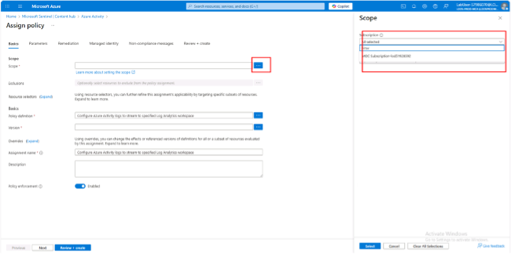.

**Do not choose a Resource Group**

9.	Click the Next button at the bottom of the Basics tab twice to proceed to the Parameters tab. On the Parameters tab click the Primary Log Analytics workspace ellipsis (…) button. In the Primary Log Analytics workspace page, make sure your subscription is selected and use the workspaces drop-down to select the Log Analytics workspace you are using for Sentinel. When done click the Select button at the bottom of the page.  

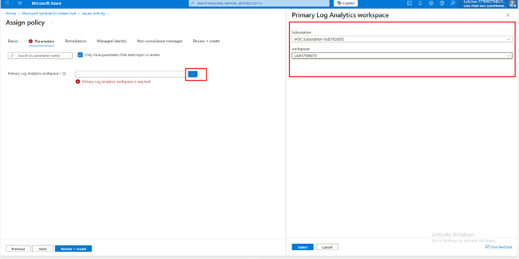.

10.	Click the Next button at the bottom of the Parameters tab to proceed to the Remediation tab. On the Remediation tab select the Create a remediation task checkbox. This will enable the "Configure Azure Activity logs to stream to specified Log Analytics workspace" in the Policy to remediate drop-down. In the System assigned identity location drop-down, select the region (East US for example) you selected earlier for your Log Analytics workspace.

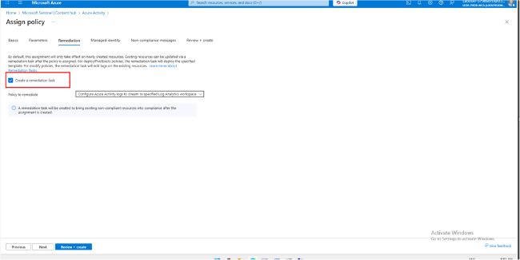.

11.	Click the Next button at the bottom of the Remediation tab to proceed to the Non-compliance message tab. Enter a Non-compliance message if you wish (this is optional) and click the Review + Create button at the bottom of the Non-compliance message tab.  

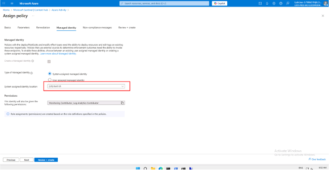.  

12.	Click the Create button. You should observe three succeeded status messages: Creating policy assignment succeeded, Role Assignments creation succeeded, and Remediation task creation succeeded.

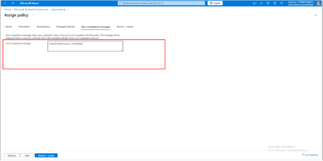.

**You can check the Notifications, bell icon to verify the three successful tasks.**

13.	Verify that the Azure Activity pane displays the Data received graph (you might have to refresh the browser page).
It may take over 15 minutes before the Status shows "Connected" and the graph displays Data received.  


**Create a rule that uses the Azure Activity data connector.** 

In this task, you will review and create a rule that uses the Azure Activity data connector.  
1.	On the Microsoft Sentinel | Configuration blade, click Analytics.  
2.	On the Microsoft Sentinel | Analytics blade, click the Rule templates tab.  

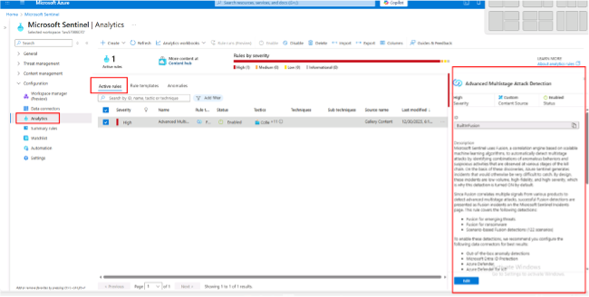.

**Review the types of rules you can create. Each rule is associated with a specific Data Source.**

3.	In the listing of rule templates, type Suspicious into the search bar form and click the Suspicious number of resource creation or deployment entry associated with the Azure Activity data source. And then, in the pane displaying the rule template properties, click Create rule (scroll to the right of the page if needed).  

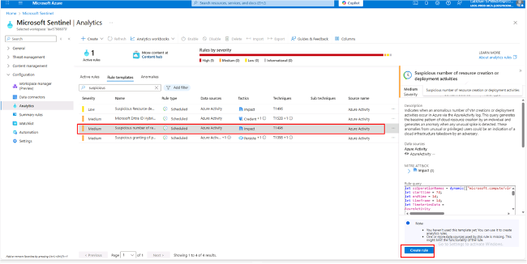.

This rule has the medium severity.  

4.	On the General tab of the Analytics rule wizard - Create a new Scheduled rule blade, accept the default settings and click Next: Set rule logic >.
5.	On the Set rule logic tab of the Analytics rule wizard - Create a new Scheduled rule blade, accept the default settings and click Next: Incident settings (Preview) >.  
6.	On the Incident settings tab of the Analytics rule wizard - Create a new Scheduled rule blade, accept the default settings and click Next: Automated response >.  

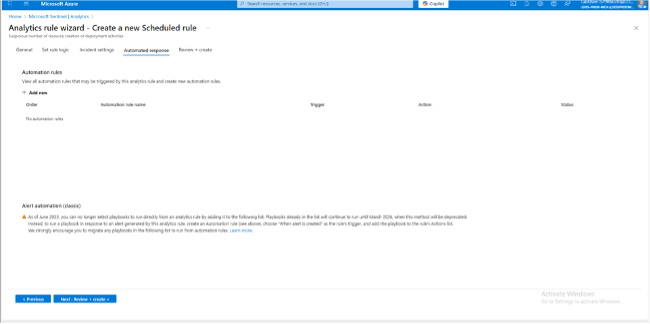.

This is where you can add a playbook, implemented as a Logic App, to a rule to automate the remediation of an issue.  
7.	On the Automated response tab of the Analytics rule wizard - Create a new Scheduled rule blade, accept the default settings and click Next: Review and create >.  
8.	On the Review and create tab of the Analytics rule wizard - Create a new Scheduled rule blade, click Save.

### 4. Create a playbook. 

In this task, you will create a playbook. A security playbook is a collection of tasks that can be invoked by Microsoft Sentinel in response to an alert.  
1.	In the Azure portal, in the Search resources, services, and docs text box at the top of the Azure portal page, type Deploy a custom template and press the Enter key.  
2.	On the Custom deployment blade, click the Build your own template in the editor option.  
3.	On the Edit template blade, click Load file, locate the \Allfiles\Labs\15\changeincidentseverity.json file and click Open.  

.

You can find sample playbooks at https://github.com/Azure/Azure-Sentinel/tree/master/Playbooks.
4.	On the Edit template blade, click Save.
5.	On the Custom deployment blade, ensure that the following settings are configured (leave any others with their default values):
Setting	Value

| Setting        | Value                                      |
|----------------|--------------------------------------------|
| Subscription   | The name of the Azure subscription         |
| Resource Group | AZ500LAB131415                              |
| Location       | (US) East US                               |
| Playbook Name  | Change-Incident-Severity                   |
| User Name      | Your email address                         |

6.	Click Review + create and then click Create.  

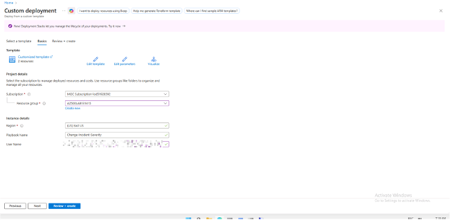.

Wait for the deployment to complete.  
7.	In the Azure portal, in the Search resources, services, and docs text box at the top of the Azure portal page, type Resource groups and press the Enter key.  
8.	On the Resource groups blade, in the list of resource group, click the AZ500LAB131415 entry.  
9.	On the AZ500LAB131415 resource group blade, in the list of resources, click the entry representing the newly created Change-Incident-Severity logic app.  
10.	On the Change-Incident-Severity blade, click Edit.  

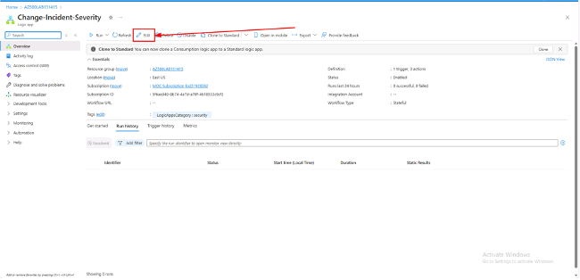.

**On the Logic Apps Designer blade, each of the four s displays a warning. This means that each needs to reviewed and configured.**

11.	On the Logic Apps Designer blade, click the first s step.  

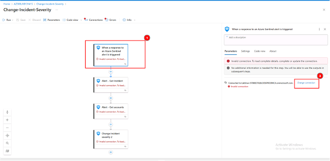.

12.	Click Change connection, then Add new, ensure that the entry in the Tenant drop down list contains your Azure AD tenant name and click Sign-in.

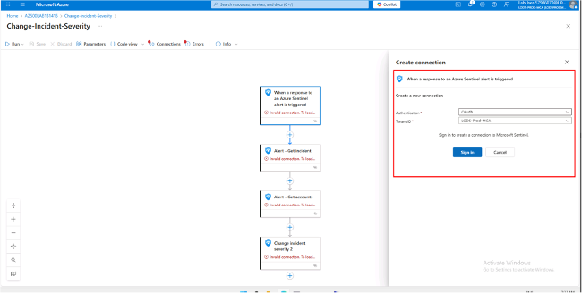.

13.	When prompted, sign in with the user account that has the Owner or Contributor role in the Azure subscription you are using for this lab.  

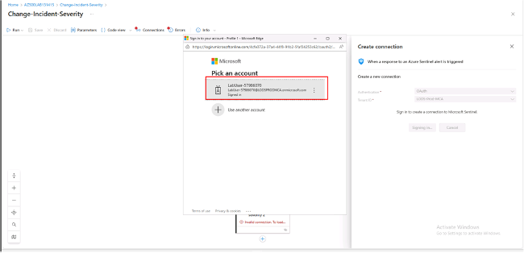.

14.	Click the second s step and, in the list of s, select the second entry, representing the you created in the previous step.  
15.	Repeat the previous step for the remaining two s steps.  

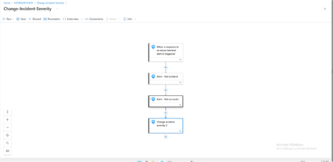.

Ensure there are no warnings displayed on any of the steps.
16.	On the Logic Apps Designer blade, click Save to save your changes.  


### Task 5: Create a custom alert and configure a playbook as an automated response. 
1.	In the Azure portal, navigate back to the Microsoft Sentinel | Overview blade.  
2.	On the the Microsoft Sentinel | Overview blade, in the Configuration section, click Analytics.  
3.	On the Microsoft Sentinel | Analytics blade, click + Create and, in the drop-down menu, click Scheduled query rule.  

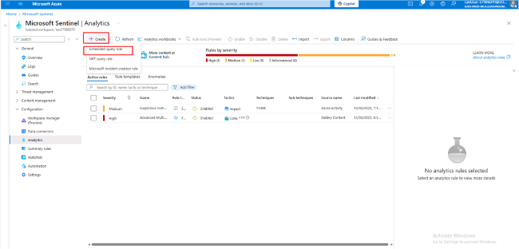.

4.	On the General tab of the Analytics rule wizard - Create a new Scheduled rule blade, specify the following settings (leave others with their default values):  

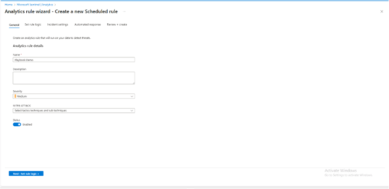.

| Setting | Value         |
|--------|---------------|
| Name   | Playbook Demo |

Tactics	Initial Access
5.	Click Next: Set rule logic >.
6.	On the Set rule logic tab of the Analytics rule wizard - Create a new Scheduled rule blade, in the Rule query text box, paste the following rule query.

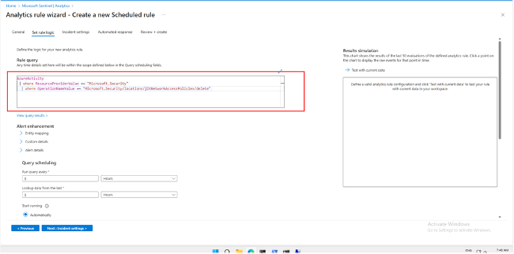. 

**AzureActivity**

```
where ResourceProviderValue =~ "Microsoft.Security"
where OperationNameValue =~ "Microsoft.Security/locations/jitNetworkAccessPolicies/delete"
```

This rule identifies removal of Just-in-time VM access policies.  

**Note if you receive a parse error, intellisense may have added values to your query. Ensure the query matches otherwise paste the query into notepad and then from notepad to the rule query.**

7.	On the Set rule logic tab of the Analytics rule wizard - Create a new Scheduled rule blade, in the Query scheduling section, set the Run query every to 5 Minutes.  

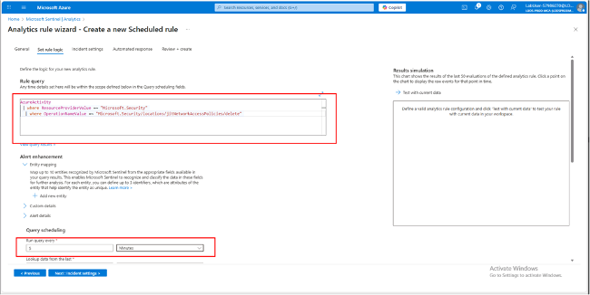. 

8.	On the Set rule logic tab of the Analytics rule wizard - Create a new Scheduled rule blade, accept the default values of the remaining settings and click Next: Incident settings >.
9.	On the Incident settings tab of the Analytics rule wizard - Create a new Scheduled rule blade, accept the default settings and click Next: Automated response >.
10.	On the Automated response tab of the Analytic rule wizard - Create a new Scheduled rule blade, under Automation rules, click + Add new.
11.	In the Create new automation rule window, enter Run Change-Severity Playbook for the Automation rule name; under the Trigger field, click the drop-down menu and select When alert is created.
12.	In the Create new automation rule window, under Actions, read the note and then click Manage playbook permissions. On the Manage permissions window, select the checkbox next to the previously created Resource group AZ500LAB1314151 and then click Apply.
13.	In the Create new automation rule window, under Actions, click the second drop-down menu and select the Change-Incident-Severity logic app. On the Create new automation rule window, click Apply.

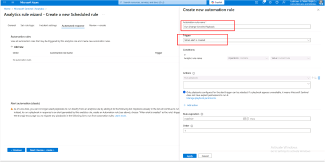.

14.	On the Automated response tab of the Analytic rule wizard - Create a new Scheduled rule blade, click Next: Review and create > and click Save. 

**You now have a new active rule called Playbook Demo. If an event identified by the rule logic occurs, it will result in a medium severity alert, which will generate a corresponding incident.**

 Invoke an incident and review the associated actions.  

1.	In the Azure portal, navigate to the Microsoft Defender for Cloud | Overview blade.  

**Check your secure score. By now it should have updated.**

2.	On the Microsoft Defender for Cloud | Overview blade, click Workload protections under Cloud Security in the left navigation.  
3.	On the Microsoft Defender for Cloud | Workload protections blade, scroll down and click Just-in-time VM access tile under Advanced protection.  

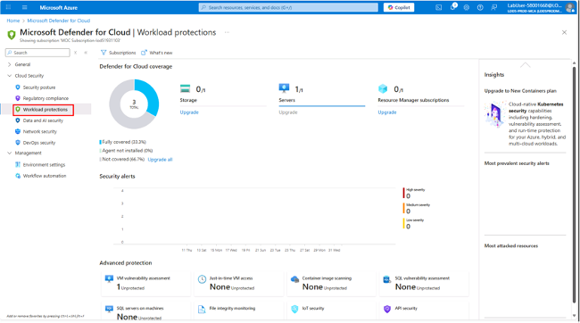.

4.	On the Just-in-time VM access blade, on the right hand side of the row referencing the myVM virtual machine, click the ellipsis (…) button, click Remove and then click Yes.

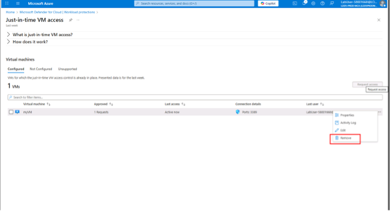.

**Note: If the VM is not listed in the Just-in-time VMs, navigate to Virtual Machine blade and click the Configuration, Click the Enable the Just-in-time VMs option under the Just-in-time Vm's access. Repeat the above step to navigate back to the Microsoft Defender for Cloud and refresh the page, the VM will appear.**

5.	In the Azure portal, in the Search resources, services, and docs text box at the top of the Azure portal page, type Activity log and press the Enter key.  
6.	Navigate to the Activity log blade, note an Delete JIT Network Access Policies entry.  

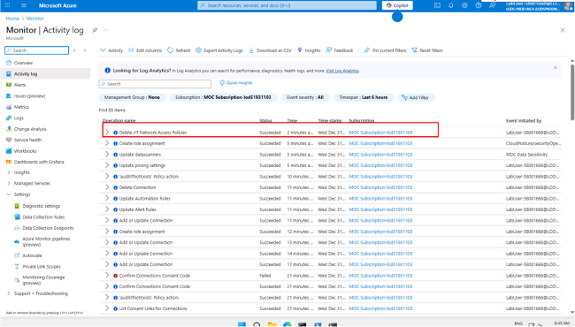.

**This may take a few minutes to appear. Refresh the page if it does not appear.**

7.	In the Azure portal, navigate back to the Microsoft Sentinel | Overview blade.  
8.	On the Microsoft Sentinel | Overview blade, review the dashboard and verify that it displays an incident corresponding to the deletion of the Just-in-time VM access policy.  

**It can take up to 5 minutes for alerts to appear on the Microsoft Sentinel | Overview blade. If you are not seeing an alert at that point, run the query rule referenced in the previous task to verify that the Just-in-time access policy deletion activity has been propagated to the Log Analytics workspace associated with your Microsoft Sentinel instance. If that is not the case, re-create the Just-in-time VM access policy and delete it again.**

9.	On the Microsoft Sentinel | Overview blade, in the Threat Management section, click Incidents.  
10.	Verify that the blade displays an incident with either medium or high severity level.  

**It can take up to 5 minutes for the incident to appear on the Microsoft Sentinel | Incidents blade.**


Review the Microsoft Sentinel | Playbooks blade. You will find there the count of successful and failed runs.
You have the option of assigning a different severity level and status to an incident.
Results: You have created an Microsoft Sentinel workspace, connected it to Azure Activity logs, created a playbook and custom alerts that are triggered in response to the removal of Just-in-time VM access policies, and verified that the configuration is valid.  


**December 25, 2025**


