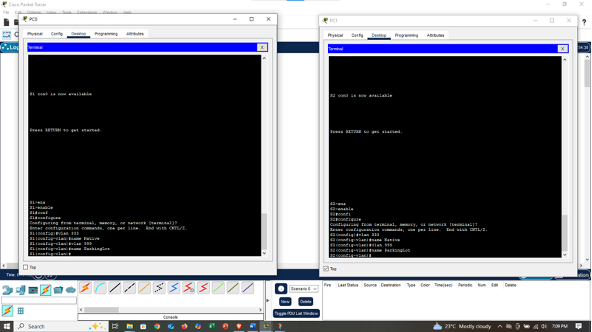
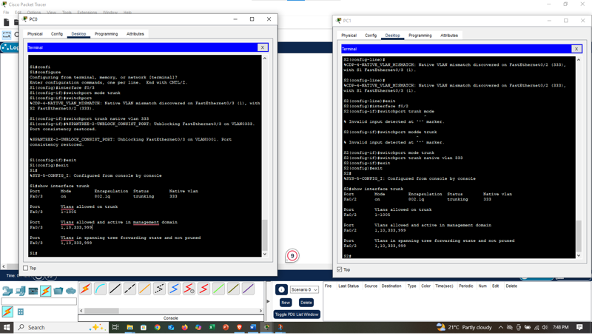
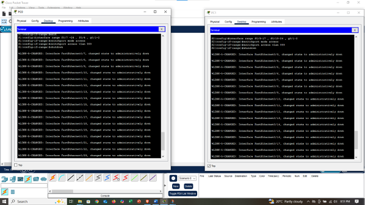
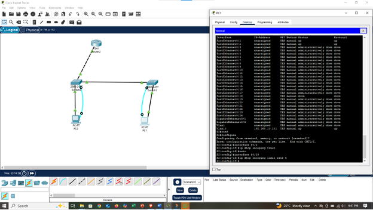

# VLANs and Secure Switch Configuration.

## Introduction

This project aims to strengthen network security and performance by preventing unwanted DNS activities, configuring VLANs to segment traffic, and implementing switch security features such as port security, DHCP snooping, and BPDU guard. These measures enhance protection against unauthorized access, malicious attacks, and network misuse while ensuring efficient and reliable communication within the LAN.  

## Objectives:  

**Part 1: Configure the Network Devices**    
    - Cable the network.  
    - Configure R1. 
    - Configure and verify basic switch settings. 
**Part 2: Configure VLANs on the Switches.** 
    - Configure VLAN10. 
    - Configure the SVI for VLAN 10. 
    - Configure VLAN 333 with the same Native on S1 and S2. 
    - Configure VLAN 999 with the name ParkingLot on S2. 
**Part 3: Configure Switch Security.**  
    - Implement 802.1Q trunking. 
    - Configure access ports   
    - Secure and disable unused switchports. 
    - Document and implement port security feactures.  
    - Implement DHCP snooping security. 
    - Implement PortFast and BPDU guard. 
    - Verify end-to-end connectivity. 

## Background. 
    This is a comprehensive lab review covering layer 2 security features
    The routers used with CCNA hands-on lab are Cisco 1841. The Switches used in this are Cisco 2960 with IOS 12.
    Note: Make sure the switches are erased and have no startup configurations.
    
**Required Resouces**  
    - 1 Router (Cisco 1841). 
    - 2 Switches (Cisco 2960 with IOS 12). 
    - 2 PCs (Windows with a terminal emulation program). 
    - Console cables to configure the Cisco IOS via the console ports. 
    - Ethernet cables. 

## Part 1: Configure the Network Devices
**Step 1: Cable the network**
1.	Cable the network.

.  

### Step 2: Configure R1. 
1.	Load the following configurations shown in the screenshot below; this is to tell the router not to assign the IP address automatically.  

.  

2.	Assign the Loopback0 an IP address which is used for logical management for the routing management.  

.  

3.	Make the line console 0 and prevent disturbance when typing on the terminal, and also make sure the person will stay there until logged out manually (disabling inactivity)

. 

4.	Verify the running configurations on R1. 

. 

### Step 3: Configure and Verify basic switch settings.
1.	Configure the hostname for Switches S1 and S2  and prevent Unwanted DNS lookups on both switches.  

.

2.	Configure interface descriptions for the ports that are in use in S1 and S2, and also assign a default gateway to the switches. 

.

## Part 2: Configure VLANs on the Switches.  
### Step 1: Configure VLAN 10.  
1.	Add VLAN 10 to S1 and S2 and name the VLAN Management. 

.

### Step 2: Configure the SVI for VLAN 10. 

.

### Step 3: Configure VLAN 333 with the name Native on S1 and S2
And also configure VLAN 999 with the name ParkingLot on S1 and S2. 

.

## Part 3: Configure Switch Security. 
### Step 1: Implement 802.1Q trunking. 
1. On both switches, configure trunking on F0/1 to use VLAN 333 as the native VLAN.  

.

2. Verify that trunk is configured on both switches. 

.

### Step 2: Disable DTP Negotiation on F0/1 on S1 and S2. 
Leaving DTP open allows someone to trick your switch into creating a trunk, giving access to all VLANs,  that’s why professionals disable DTP on all ports that don’t explicitly need to negotiate.  

.

### Step2: Configure access ports. 
On S1, configure F0/5 and F0/6 as access ports that are associated with VLAN 10.  

.
 
### Step 3: Secure and disable unused switchports.  
1.	On S1 and S2, move the unused ports from VLAN 1 to VLAN 999 and disable the unused ports.  

.

2.	Verify that the unused ports are disabled and associated with VLAN 999 by issuing the show command.  

.

### Step 4: Document and implement port security features.
The interface f0/6 on S1 and F0/18 on S2 are configured as access ports. In this step, you will also configure port security on these two access ports.  
1.	On S1, issue the show port-security interface f0/6 command to display the default port security settings for the interface f0/6.  

.  

2. Show port security on S1 F0/6. 

.  

3.	Enable port security for F0/18 on S2. Configure the port to add MAC address learned on the port automatically to the running configuration.  

.  

4.	Configure the following port security settings on S2 F0/18. 
    - Maximum number of MAC addresses to 2. 
    - Violation type: protect. 
    - Aging time: 60min.  

. 

5.	Verify port security on S2 F0/18. 

. 

### Step 5: Implement DHCP snooping security.  
1.	On S2, enable DHCP snooping and configure DHCP snooping on VLAN 10. 

.

2.	Configure the trunk port on S2 as a trusted port and limit the untrusted port, F18 on S2, to five DHCP packets per second.  

.  

3.	Verify DHCP Snooping on S2

. 

4. From the Command Prompt on PC-B, release and then renew the ip address

In reference to Port Security on S2, if you load the running-config script on S2, you will reliaze that PC-B on port
18 never get an IP address via DHCP, this is because Port security is set for only two MAC addresses and port 18 has two “sticky” MAC address bound to the port. Additionally, the violation is protect, which will never send a console/syslog message or increment the violation counter.

### Step 6: Implement PortFast and BPDU guard.
1. Configure PortFast on the all the access ports that are in use on both switches

.   

2. Enable BPDU guard on S1 and S2 VLAN 10 access ports connected to PC-0 and PC-1. 

. 

3. Verify that BPDU guard and PortFast are enabled on the appropriate ports.  

. 

### Step 7: Verify end-to-end connectivity. 
Verify PING connectivity between all devices in the IP Addressing Table. If the ping fails, you may need to disable the firewall on the PC host.  

## Conclusion.  
In conclusion, the project was successfully completed, achieving all key network security and configuration objectives. BPDU security was effectively implemented to protect against bridging loops, access points were properly configured for reliable connectivity, and port security measures; including sticky MAC address configuration; were successfully applied to prevent unauthorized device access. Additionally, DHCP snooping was configured to safeguard against rogue DHCP servers, and loop prevention mechanisms such as PortFast were enabled to improve network efficiency and stability. Overall, the project strengthened network integrity, performance, and resilience against common security threats.  

